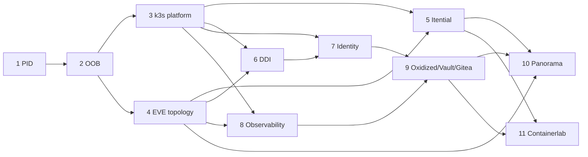

# Project Initiation Document — itential-enterprise-lab

| | |
|---|---|
| **Name** | itential-enterprise-lab |
| **Version** | 1.33 |
| **Date** | 2026-09-24 |
| **Author** | Elliot Conner. Claude Code is the build agent; every action it takes is bounded by this document |
| **Standard** | Project Initiation Standard PIS-01 - PIS-30 (`~/.claude/skills/project-initiation-standard`) |
| **Companion docs** | `docs/discovery.md` (what exists), `docs/ip-plan.md`, `docs/resource-budget.md`, `docs/image-manifest.md`, `docs/adr/` (why), `docs/manual-steps.md` |

**How to read the agent rules.** The PIS is written for AI-agent products. In
this project the "agent" is **Claude Code driving OpenTofu, Ansible, the
EVE-NG REST API and the NetBox API to build the lab**, and, from Phase 5, **Itential
workflows acting on the lab network**. Every rule below is answered for both
meanings where they differ.

---

## Domain 1 — Intent Specification

**PIS-01 — One-sentence purpose**

> Build, entirely from this repo, a rebuildable enterprise services layer around a multi-vendor EVE-NG lab network on one Proxmox host, so that Itential Platform can demonstrate end-to-end network automation (source of truth to ticket to device to monitoring) for Elliot's portfolio and teaching content.

**PIS-02 — Capabilities at launch**

The full, service-by-service capability list with acceptance criteria is
section 2. In summary, at the end of Phase 11 the lab must:

1. Bring up every Proxmox VM, bridge, template and k3s workload from `make up` with no manual step other than those in `docs/manual-steps.md` (vendor downloads and eval-license activation).
2. Build the EVE-NG topology (DC with a PA-VM HA pair, two C8000v WAN edges, two vEOS spines, two leaves, one access switch; two branches each with a C8000v, a PA-VM, a vEOS and endpoints; one simulated ISP core) from `topology/*.yaml`, and populate NetBox from the same file.
3. Address every service and device from NetBox (ADR 0002, ADR 0003) on the OOB network 10.100.0.0/24, resolvable in `lab.internal` (ADR 0005).
4. Run Itential Platform + Automation Gateway with working adapters for NetBox, ServiceNow PDI, PAN-OS/Panorama, Infoblox, Cisco IOS XE, Arista EOS and Zabbix, and execute the golden-path workflow in PIS-05.
5. Serve DNS/DHCP from Infoblox NIOS with a BIND9/Kea secondary that keeps serving through an eval expiry (ADR 0009).
6. Authenticate humans with Keycloak (OIDC/SAML) backed by Active Directory, and network devices with tac_plus backed by the same directory.
7. Monitor every service and device with Zabbix (availability, SNMP) and Prometheus/Grafana (metrics), stream gNMI telemetry through gNMIc, and centralise logs/syslog in Loki.
8. Back up every device configuration to Oxidized -> Gitea on change, and hold every secret in Vault (no secret in `.env` after Phase 9).
9. Manage all firewalls from Panorama (templates, device groups, commit/push driven by Itential).
10. Validate fabric changes in a Containerlab cEOS twin of the DC before Itential pushes them to EVE-NG.
11. Stay inside the ceilings in `docs/resource-budget.md`: 1.5:1 vCPU oversubscription (108 vCPU) and 300 GB RAM allocated (280 until amendment 1.30, ADR 0063; 296 until 1.32).
12. Prove every one of the above with a committed `verify/` result.

**PIS-03 — Explicit exclusions**

The lab will **not**:

- Change the configuration of `vmbr0`, `nic1`, the home router, or the home DHCP/DNS. `oob-gw`, NetBox and EVE-NG have addresses *on* the home LAN; nothing *configures* it.
- Expose any service to the internet (no port forwards, no public DNS, no public certificates). Remote access is the existing EVE-NG WireGuard or the workstation only.
- Provide hypervisor high availability, a second disk, RAID, or off-host backups. Mitigation for the single SSD is rebuildability (Domain 4).
- Attach a physical lab switch to `nic2`; the OOB network is host-internal.
- Deploy Cisco SD-WAN/vManage, ISE, NSO, Catalyst Center, Nutanix, VMware, Infoblox BloxOne, Palo Alto Prisma, or any product not in the image manifest.
- Use paid or perpetual licenses beyond the EVE-NG Pro license already owned. Every vendor image is an evaluation or a free lab edition, and their expiries are tracked (`docs/image-manifest.md`).
- Move NetBox off VM 110 into k3s (discovery assumption 10).
- Let any automation edit NetBox to match the network (ADR 0002). Sync is one-way: NetBox -> devices.
- Design ITSM processes in ServiceNow. The PDI is used as an API endpoint for the Itential adapter (change requests and incidents via the Table API), nothing more.
- Manage Windows clients beyond domain join and a test user; no GPO engineering, no Intune.
- Run any CI job from GitHub-hosted runners against the lab. The Containerlab tier is self-hosted and reached only from the lab.
- Store any secret, kubeconfig, token, image or `.tfstate` in git.

**PIS-04 — Escalation path**

Claude Code **stops and hands to Elliot** when any of these triggers fires:

| Trigger | Handoff carries |
|---|---|
| The next action would modify `vmbr0`, `nic1`, or anything on the home LAN other than a VM's own guest config | The exact command, why it seemed necessary, the alternative that avoids it |
| The next action is destructive: deleting a VM/LV/lab/NetBox object not created by the current phase, rebooting EVE-NG or the Proxmox host, wiping a Longhorn volume | Target object, what depends on it, the rollback |
| A phase verification test fails twice after one fix attempt | Test output, hypothesis, what was tried, current infrastructure state |
| A vendor login, EULA click, or eval-license activation is needed | The exact product/version/filename from the manifest, target path, expected checksum |
| A resource-budget ceiling would be crossed | The line in `docs/resource-budget.md` that would go over, options to trim |
| A decision arises that no ADR covers | A drafted ADR with the options and a recommendation |
| The previous phase's PR is not merged | Nothing is started (`gh pr list --state all` is the gate) |

Itential workflows (Phase 5+) escalate to a human approval task in the platform
before any device commit, and post the pre/post diff to the ServiceNow change.

**PIS-05 — Definition of functional correctness**

"It worked" means all of the following are true and evidenced by committed
`verify/results/` logs:

1. **Rebuild test.** From a fresh clone plus `.env` plus staged images, `make up` reaches Phase 11 and `make verify` passes every test, with human involvement limited to `docs/manual-steps.md`.
2. **Golden path.** An Itential workflow, triggered by a ServiceNow change request, (a) reserves a VLAN, prefix and gateway IP in NetBox, (b) pushes the VLAN to the DC leaf pair and branch switch, (c) adds the security policy and NAT to the branch firewall via Panorama, (d) creates the DHCP range and DNS records in Infoblox, (e) runs pre/post checks (BGP/EVPN state, ping from the branch client), (f) closes the change with the diff attached. Elapsed time under 10 minutes, zero manual steps, and the Containerlab twin validated the switch change first.
3. **Cross-checks.** For every device, NetBox (intent), the EVE-NG API (what was built), and the device itself (`show` output via the Itential/Ansible path) agree on hostname, management IP, image version and interface count. Two independent sources must confirm every fact (`verify/` never trusts one API).
4. **Budget.** Allocated vCPU <= 108 and allocated RAM <= 300 GB (1.30, ADR 0063; 1.32), measured from `qm config` on the host, not from the docs.
5. **Security floor.** No secret in git (gitleaks), no default vendor password left on any node after its phase, every human-facing UI behind Keycloak or AD, TLS from the lab CA on every HTTP service.

---

## 2. Service specifications

Conventions: **Placement** is Proxmox VM (OpenTofu + Ansible), k3s (Helm/Kustomize) or EVE-NG node (topology YAML). **Version** is always the pinned value in `docs/image-manifest.md`; this document never repeats a version number so that the manifest stays the single oracle. **IP / name** come from `docs/ip-plan.md`. **Resources** from `docs/resource-budget.md`. Each spec ends with the acceptance criteria that become the GitHub issue and the verification test that becomes `verify/test-NN-<name>.sh`.

### S0 — NetBox (exists; hardened in Phase 2)

- **Purpose:** network source of truth (ADR 0002). Sites, devices, interfaces, prefixes, IPs, VLANs, VMs, services, secrets *references* (not values).
- **Placement:** existing Proxmox VM 110 (netbox-docker), stays (assumption 10).
- **Phase 2 changes:** second vNIC on `vmbr1` at 10.100.0.64; qemu-guest-agent installed; nightly `pg_dump` + media tarball to Longhorn-backed MinIO once Phase 3 exists (until then to the VM's own disk with 7-day rotation); described, expiring automation token; HTTPS via the lab CA behind Traefik on the OOB address in Phase 7 when Keycloak SSO is added.
- **Acceptance:** `GET /api/status/` on the OOB address returns 200; the IP plan's prefixes, ranges and reserved IPs exist; backup file newer than 24 h exists; token has description and expiry.
- **Verification:** `verify/test-02-oob.sh` (shared with S1).

### S1 — OOB management network (Phase 2)

- **Purpose:** one flat, isolated management segment that every service and device is reachable on, independent of the lab's in-band network.
- **Placement:** Proxmox `vmbr1` (untagged), EVE-NG `pnet1` via a hot-plugged `net1` on VM 300, `oob-gw` VM (ADR 0004).
- **Components:** `oob-gw` (Ubuntu cloud image, nftables NAT, unbound forwarding resolver until Phase 6, sshd), Proxmox `tofu@pve` user + token (assumption 4), `snippets` on `local` (assumption 5), `/srv/images` LV (ADR 0007), Ubuntu cloud-init template, NetBox seed of `docs/ip-plan.md`, EVE-NG admin password rotation (assumption 12), workstation static route.
- **Acceptance:**
  1. From the workstation, `ping 10.100.0.1` and `ssh oob-gw` succeed via the static route.
  2. EVE-NG shows `pnet1` with `eth1` as a member and 10.100.0.2 answers from `oob-gw`.
  3. A throw-away VM cloned from the template boots with the IP NetBox reserved for it, resolves `github.com` through `oob-gw`, and can `apt update`.
  4. NetBox holds 10.100.0.0/14, 10.100.0.0/24, the block ranges and every static in the IP plan; `tofu plan` on the OOB module is clean.
  5. `/srv/images` is mounted from the thin LV with >= 150 GB free.
  6. The EVE-NG API rejects the factory password and accepts the one in `.env`.
  7. `vmbr0` and `nic1` stanzas in `/etc/network/interfaces` are byte-identical to the discovery snapshot.
  8. Client access: from a home-LAN device with the route in place, `dig lab.internal` names resolve via 192.168.68.120 and `curl http://netbox.lab.internal:8080/api/status/` returns 200 (proves route + DNS + NAT-free return path).
- **Verification:** `verify/test-02-oob.sh`.

### S2 — k3s platform (Phase 3)
> **Amendment 1.31 (ADR 0064):** the lab's CloudNativePG databases (`platform-db`, `zabbix-db`) are rebuildable and are not backed up: no WAL archiving, no scheduled backups, no ObjectStores. Garage and the Barman Cloud plugin stay, unused. Criterion 5 asserts the absence.

- **Purpose:** the runtime for every containerised service (S6 tac_plus/Keycloak, S7, S8) with persistent storage and stable service IPs.
- **Placement:** three Proxmox VMs `k3s-01..03`, each a server node (embedded etcd), on `vmbr1`.
- **Components:** k3s (flannel, kube-proxy and ServiceLB disabled; the bundled Traefik kept as the ingress controller because ingress-nginx is retired), Cilium (kube-proxy replacement, Hubble), MetalLB L2 pool 10.100.0.32-63, Longhorn (2 replicas: the host has one disk, so a third replica adds cost without resilience; Prometheus and Loki volumes at 1 replica per the budget), cert-manager with a lab root CA issuer, CloudNativePG operator, Traefik at 10.100.0.32 with a wildcard `*.lab.internal` certificate, kube-vip for the API VIP 10.100.0.19. Kubeconfig lives only in an `.env`-referenced path, never in git.
- **Acceptance:**
  1. `kubectl get nodes` shows three Ready nodes via the VIP; `cilium status` reports OK; Hubble observes flows.
  2. A test Deployment with a Longhorn PVC survives `tofu` stopping one node (data intact, pod rescheduled within 5 min).
  3. A test Service of type LoadBalancer gets 10.100.0.43 and is reachable from the workstation and from an EVE-NG endpoint.
  4. cert-manager issues a certificate for `test.lab.internal` chained to the lab root CA, and the root CA cert is exported to `docs/` for client trust (public material only).
  5. *(1.31, ADR 0064)* A CloudNativePG cluster of one instance is healthy and passes `pg_isready`, and **no** lab CNPG database is backed up: in any namespace there is no `ScheduledBackup`, no Barman Cloud `ObjectStore`, no `Cluster` naming a plugin, no Barman sidecar in an instance pod, and no primary holding WAL segments waiting to be archived. (Was: "its scheduled backup object lands in a Longhorn-backed bucket".)
  6. Cluster allocation in `docs/resource-budget.md` matches `qm config`.
- **Verification:** `verify/test-03-platform.sh`.

### S3 — Network topology (Phase 4)

- **Purpose:** the network Itential automates. Realistic enough to demo enterprise workflows: DC with HA firewalls and an EVPN-VXLAN fabric, WAN over a simulated provider, two branches.
- **Placement:** EVE-NG nodes, built by `eve/` from `topology/*.yaml`; NetBox populated from the same YAML (ADR 0002).
- **Topology commitment (minimum):**
  - `isp-core01` (C8000v): provider core, gives each site a /30 and a default route; no tunnels terminate here.
  - DC1: `dc1-wan01/02` (C8000v, eBGP to ISP, IPsec/GRE tunnels to each branch, iBGP + HSRP inside), `dc1-fw01/02` (PA-VM active/passive HA, HA1/HA2 links, virtual routers north/south), `dc1-spine01/02` + `dc1-leaf01/02` (vEOS, eBGP underlay, EVPN-VXLAN overlay, leaf pair as MLAG), `dc1-acc01` (vEOS L2 access), `dc1-srv01` (Ubuntu).
  - Branch 1 and 2: `brN-wan01` (C8000v, tunnels to both DC edges, BGP), `brN-fw01` (PA-VM, standalone, NAT + policy), `brN-sw01` (vEOS L2), `brN-pc01` (Windows 11), `brN-host01` (Alpine).
  - Every node's first interface is management on `pnet1` with the static from the IP plan; management VRF/interface only, no in-band management.
  - DNS domain on every node `lab.internal`; NTP from `oob-gw`; syslog/SNMP/gNMI/NETCONF/RESTCONF/eAPI/XML-API enabled with a local `automation` account whose password is in `.env` (moved to Vault in Phase 9); TACACS+ added in Phase 7.
- **Acceptance:**
  1. `eve/build.py topology/dc1.yaml` creates the lab idempotently (second run reports no changes) and every node reaches `running`.
  2. Every node's management IP answers SSH within 20 minutes of a cold lab start (this is the PAN-OS boot-storm test: firewalls are started in two waves of two, 5 minutes apart, by the builder).
  3. NetBox has one device, its interfaces, its cables and its primary IP for every node in the YAML, and the count of cables equals the count of EVE-NG links.
  4. Routing: `isp-core01` has a BGP session to each of the five edge routers; each branch has two established tunnels; DC leaves show two EVPN peers and MLAG active; `dc1-fw01` is active and `dc1-fw02` passive.
  5. `br1-pc01` reaches `dc1-srv01` through branch fw -> tunnel -> DC fw -> fabric (traceroute recorded).
  6. Image versions reported by every node (`show version`, `show system info`) equal the manifest.
  7. RAM allocated inside EVE-NG <= the EVE line in the resource budget.
- **Verification:** `verify/test-04-topology.sh`.

### S4 — Itential Platform + Automation Gateway (Phase 5)

- **Purpose:** the automation brain. Workflows, JSON forms, pre/post checks, adapters to every other service.
- **Placement (amended 1.4, 2026-09-07):** one **Ubuntu 24.04** Proxmox VM `itential` (VM 205, 10.100.0.65, 8 vCPU / 24 GB / 160 GB) running Docker CE and the vendored `itential-dev-stack` Compose file: Platform, MongoDB 7, Redis 7, Gateway 5, Gateway 4 and the MCP server as containers (ADR 0035). The separate `iag` VM, the Rocky template and 10.100.0.66 are dropped. ~~two **Rocky 9** Proxmox VMs (`itential` all-in-one and `iag`)~~. **Since S11.8 (2026-09-10) VM 205 no longer exists**: these assets were replayed onto the production environment (ADR 0055) and run on `iap-01`, the active Platform node. The placement below is what this phase built, not where it runs today. **Since 1.30 a dev stack runs again at .65 as `itential-dev`** (alias `mcp-dev`): the Copilot sandbox of S12, built by the same plays with the dev overlay (ADR 0063). The names `itential` and `mcp` stay with production.
- **Components (amended 1.4):** container images per manifest section 3.5 pulled from Itential's private ECR with the owner's company SSO session (ADR 0020 amendment records the tags); ~~installed with `itential.deployer` and `itential.iag5` from the RPM repository~~. Adapters from the open-source library: NetBox, ServiceNow, Panorama, Infoblox, Zabbix, Vault (Phase 9), generic git for Gitea (Phase 9). **There is no adapter for Cisco IOS XE or Arista EOS**: those devices are reached through Gateway (netmiko/NETCONF/Ansible) and the vendor pre-built automations. Local admin account plus LDAP to Active Directory in Phase 7 (Platform supports SAML and LDAP for users, not OIDC).
- **Licence risk (resolved 1.4):** the owner confirmed on 2026-09-07 that no licence is needed for the lab images and that ECR access via company SSO is the supported path (PIS-04 trigger closed). ~~If access cannot be obtained, this phase is blocked.~~
- **Acceptance:**
  1. Platform UI and API reachable on 10.100.0.65 over TLS from the lab CA; IAG registered as a gateway in the platform.
  2. NetBox adapter: a workflow reads the device list and returns the same count as `GET /api/dcim/devices/`.
  3. Device adapters: a workflow runs `show version` on one node of each vendor through IAG and the version string equals the manifest.
  4. First workflow (`Add Branch VLAN`): given a branch and a VLAN name, reserves a VLAN in NetBox and configures it on the branch switch, with a manual approval task and a NetBox rollback on failure. Runs green twice; the second run is a no-op. (Amended 1.9, ADR 0044: the approval task is the JSON form `lab-branch-vlan-approval` with a decision field; an API approval finishes it with `export.decision = approve`, a rejection stays a failure finish; the workflow also publishes the `instance` object Lifecycle Manager stores.)
  5. Licence state and any expiry recorded in the manifest; expiry monitored by Zabbix from Phase 8.
  6. `itential` VM memory pressure measured after 24 h of normal use (`free`, MongoDB WiredTiger cache); if above 80 % the budget lever list is applied by PR.
  7. Client reachability: from the Mac Mini on the home LAN, Claude Code lists the Itential MCP server's tools (`itential-mcp` container on OOB, name `mcp.lab.internal`) and runs a read-only tool call that returns the platform's version; the same works from the work laptop when it is on the home LAN.
- **Verification:** `verify/test-05-itential.sh`.

### S4b — ServiceNow PDI adapter configuration (Phase 5)

- **Purpose:** ticket-driven automation entry point.
- **Placement:** external (ServiceNow Personal Developer Instance owned by Elliot). Only the adapter configuration and a keep-alive job live in this repo.
- **Components:** Itential ServiceNow adapter pointed at the PDI over HTTPS with a dedicated integration user (basic auth, credentials in `.env`, later Vault); the `Add Branch VLAN` workflow extended to open, update and close a change request; ~~the PDI's Itential-related customisations exported as an update set into `servicenow/`~~ (amended 1.5: the PDI is used stock, `servicenow/README.md` is the rebuild record).
- **Keep-alive is a human step.** ServiceNow reclaims a PDI that is 90+ days old with no *interactive* login in 10 days, and API traffic does not count (manifest 3.4). The owner logs in at least every 10 days (calendar reminder recorded in `docs/manual-steps.md`); `verify/` checks the PDI's last-login date and warns at 7 days.
- **Acceptance:**
  1. Adapter health check green in the platform.
  2. A workflow creates a change request, writes the NetBox reservation into its work notes, and closes it; the change's state history shows all three transitions.
  3. The update set export exists in the repo and re-imports cleanly into a fresh PDI (tested once).
  4. The PDI instance name and release family are recorded in `.env` and the manifest, never the password.
  5. `verify/` reports days since the last interactive login and fails the phase test if over 10.
- **Verification:** part of `verify/test-05-itential.sh` (skips with a loud `HIBERNATED` message, not a pass, if the PDI is asleep).

### S4c — FlowAI agents over the lab topology (Phase 6, ADR 0037)

- **Purpose:** the reason the lab exists: agents that operate the EVE-NG topology through the Platform's governed tools, with a human approval where the network changes.
- **Placement:** the FlowAI applications inside the Platform image on VM 205 (Agent Projects, Agent Execution Engine, Agent Session Manager, Tool Registry, Model Registry); an `ollama` container on the same VM for local models; the owner's Mac Mini Ollama as an optional fast endpoint. **Since S11.8 (2026-09-10) VM 205 no longer exists**: these assets were replayed onto the production environment (ADR 0055) and run on `iap-01`, the active Platform node. The placement below is what this phase built, not where it runs today.
- **Components:** Model Registry provider profiles (Anthropic `claude-sonnet-5` default; Ollama in-lab with pinned small instruct models; Ollama on the Mac, optional), tools registered from the NetBox adapter, Gateway 5 device services on the `lab` inventory and the lab workflows (`itential/workflows/`), one agent project `lab-netops` generated from `itential/agents/` by `ansible/playbooks/flowai.yml`, the ServiceNow Integration Model for agent tool use, and the MCP server already reachable from Claude Code (S4.7). Everything is created through the API and held in the repo; provider keys stay in `.env`.
- **Acceptance:**
  1. Two provider profiles exist and answer: Anthropic and the in-lab Ollama; the model list of each is fetched through the Model Registry and the pinned models are present.
  2. The agent, asked for the software version of a named node, answers with the string the device itself returns over direct SSH (both vendors, one node each), using the Gateway 5 tool; the session shows the tool call.
  3. The agent, asked to add a named VLAN to a branch, runs `Add Branch VLAN`; the job pauses on the approval task in Work Center, the VLAN is reserved in NetBox and configured on the switch only after approval, and the second identical request is a no-op.
  4. The agent refuses (does not call the gateway) for a node that is not in the inventory, and every session records its token usage per model.
  5. The same question in criterion 2 answered by the in-lab Ollama model; response time and VM memory recorded in the manifest.
  6. Claude Code on the Mac drives criterion 2 through the MCP server (an agent session started and read back via MCP tools).
  7. Structured device data (amendment 1.7, ADR 0038): `Run Show Command on a Device` returns the raw text and a parsed object for one show command per vendor, Genie for the Cisco node and TextFSM (ntc-templates) for the Arista node, chosen from the node's NetBox platform; the parse runs as Gateway 5 inline code on a glibc runner node (etcd store) and the parsed values equal the device's own output over direct SSH.
- **Verification:** `verify/test-06-flowai.sh`; a criterion that spends provider tokens records the cost in the log.

### S4d — Platform coverage of the EVE-NG lab (Phase 6, amendment 1.8, ADR 0040)
> **Amendment 1.19 (ADR 0054):** S4d.4's Integration Models become the way the lab reaches NetBox and ServiceNow; the npm adapters are converted away after the Phase 8 cut-over, except the NetBox adapter the InventoryBroker consumes.

- **Purpose:** every Platform application operates the lab devices, so the agents in S4c have governed tools for configuration standards, checks, backups, service lifecycle and tickets, not only ad-hoc show commands.
- **Placement:** the Platform on VM 205; devices through the InventoryBroker adapter (ADR 0039) and Gateway 5 only. No new VM, no Gateway 4. **Since S11.8 (2026-09-10) VM 205 no longer exists**: these assets were replayed onto the production environment (ADR 0055) and run on `iap-01`, the active Platform node. The placement below is what this phase built, not where it runs today.
- **Components:** `ansible/playbooks/platform.yml` creates everything from documents in `itential/` through the API and re-runs idempotently, in the order `itential.yml`, `platform.yml`, `flowai.yml`. Device groups by site (dc1, br1, br2, wan) and role from the NetBox tags already on the inventory nodes. One Golden Config tree per OS (`cisco-ios`, `arista-eos`) rendered from `itential/golden-config/<os>.j2`: base node = OS baseline (management VRF, AAA and the automation user, DNS/NTP/logging, SSH/eAPI), site nodes with the site device group attached, one leaf per device carrying the NetBox intent (hostname, management interface and primary IP); every inventory node attached at its leaf. One compliance plan with one node entry per device leaf, run nightly by an Operations Manager schedule trigger on a generated workflow. Command templates, backup schedule, Lifecycle Manager model, JSON Form, Integration Models, the agent fleet and the host inventory follow as elements 2 to 6 (acceptance below); element 3 adds `itential/lcm/` (model), `itential/forms/` (generated form) and `tasks/lcm.yml` (ADR 0043/0044); element 4 adds `itential/integrations/` (generated OpenAPI documents) and `tasks/integrations.yml` (ADR 0045). Remediation is never automatic: a violation becomes a config push (`Push Configuration with Approval`) behind a Work Center approval (Platform 7 removes auto-remediation).
- **Finding at the start of S4d (ADR 0041):** all five IOS-XE routers ran and booted as `hostname Router` since Phase 4 (the config.iso bootstrap skipped line one of the template; verify 04 reached devices by IP and never checked). Restored through `Push Configuration with Approval` with the approval before criterion 1 is measured; the Phase 4 root cause is a follow-up issue.
- **Acceptance:**
  1. Golden Config: the plan runs against all 12 devices with zero violations; after a deliberate hostname change on one device per vendor the next run flags exactly those two with no other issue; the names are restored through the governed push and the plan is clean again. Second source: `verify/devcmd.py`.
  2. Command templates and backups (ADR 0042): each pre/post template (version, interfaces up, BGP neighbours; the topology runs no OSPF, ADR 0034) runs on one device per vendor with every pass/fail rule evaluated, and the analytic template passes on a pre/post pair; the nightly schedule trigger exists and, after one run of the backup workflow, the newest backup of every device equals the running config over direct SSH.
  3. Lifecycle Manager and JSON Forms (amended 1.9, ADR 0043/0044): resource model `branch-vlan` with create (`Add Branch VLAN`) and delete (`Remove Branch VLAN`; the switch write only as a child job of `Push Configuration with Approval`) actions, the actions naming their workflows so the nightly re-import keeps them valid; instances named `<branch>-<vlan_name>`, one imported per existing NetBox branch VLAN; a create, instance, delete round trip on br2 with the Work Center approvals: the JSON form `lab-branch-vlan-approval` on the create showing branch, VLAN id and name, switch and the NetBox reservation (read back through the Work Center API, NetBox as the second source), the push card on the delete; instance history with both executions and their jobs; the delete workflow on a retired VLAN is a no-op with no push job; a rejected push under the delete changes nothing, and a create rejected on the form rolls its reservation back and is retired by cancelling its execution (a job in error is retryable, so the execution waits). ~~create (`Add Branch VLAN`) and delete (new workflow) actions; ... form fields ... shown on the approval task~~.
  4. Integration Models (amended 1.10, ADR 0045): `lab-netbox` and `lab-servicenow` generated by `itential/integrations/build.py` (six NetBox reads; ServiceNow incidents and changes, one write: incident work notes), instances `netbox-api` and `servicenow-api` (the PDI's `itential.integration` user) created by `tasks/integrations.yml` with the model roles re-synced and every operation an authorized tool (`integration:<title>%3A<version>:<instance>:<operationId>`); `lab-netops` reads the site and role of br1-sw01 and the short description of INC0000060 through them, the sessions naming the integration operations and never an adapter method; NetBox and the PDI's Table API are the second sources. ~~ServiceNow (OpenAPI upload, instance with `itential.integration`) and NetBox registered; an agent reads an incident and a device through them, the session shows the integration tool, not the adapter.~~
  5. Agent fleet (amended 1.11, ADR 0046; memory `work-laptop-agent-fleet`): `netbox-sot`, `device-ops`, `compliance`, `diagnostics` and `remediation` as `itential/agents/` documents, each on Claude and as an `ollama-lab` twin with one to three tools; the read tiers hold no device-writing tool; diagnostics writes one work note ("Proposed fix: ...") to the incident, the fleet's only ungated write (a ticket, not a device); remediation's only write is `Push Configuration with Approval` behind the Work Center card. Acceptance in `verify/test-06-flowai.sh` (S4d.5a to S4d.5f, tokens printed): netbox-sot's count of active dc1 devices equals NetBox; device-ops's version of br2-sw01 equals direct SSH; compliance runs lab-baseline and reports it clean against the batch reports; after a deliberate hostname drift on br2-sw01 (governed push, approved by the verify) diagnostics's note on an incident the verify creates names the drift and proposes `hostname br2-sw01`; remediation starts `Push Configuration with Approval` with that line, the verify approves the card and direct SSH confirms the restore; netbox-sot-local answers a site question with its response time and the VM memory recorded; `Run Show Command on All Devices` (one show command on every lab device in one call, parsed per device) answers a fleet-wide question on lab-netops-local with the device count NetBox confirms. ~~each on Claude and a local twin; one acceptance per agent in `verify/test-06-flowai.sh` with token usage; every write behind an approval.~~
  6. Hosts and firewalls (amended 1.12, ADR 0047): the three Ubuntu hosts (`dc1-srv01`, `br1-host01`, `br2-host01`) as Gateway 5 inventory nodes in their own inventory `lab-hosts` (platform `linux`, the automation account with the password `lab-endpoints.yml` enables for that user only), never published to Configuration Manager; reachability and uptime through Gateway 5 `send-command` with direct SSH as the second source; PA-VM firewalls when the image is staged (deferred with S3.4). ~~the three Ubuntu hosts as inventory nodes with reachability and uptime checks~~
- **Deferred (not built in S4d):** Gateway 4, observability and job metrics (Phase 9), node-credential secrets (Phase 10), Windows endpoints.
- **Verification:** `verify/test-06b-platform.sh` (S4d.1 to S4d.4 and S4d.6); S4d.5 in `verify/test-06-flowai.sh`.

### S4e — NetBox enrichment derived from the topology (Phase 6, amendment 1.13, ADR 0048)

- **Purpose:** NetBox answers what the lab really runs beyond management (owner request 2026-09-08): every address on its interface with the peer description, VRFs and ASNs, racks, the provider circuits, config contexts and journal entries, so `netbox-sot` and Golden Config (ADR 0040) read intent instead of the management skeleton.
- **Placement:** NetBox 4.7.0 on VM 110 (no plugin; BGP neighbours live in config contexts, ADR 0048). No new VM.
- **Components:** `topology/enterprise.yaml` gains `addressing` per node, `vrfs`, `racks`, `circuits`; the startup-config templates read them (rendered output byte-identical, proven by `tests/test_topology.py` against `topology/generated/configs/`); `ansible/playbooks/netbox-enrich.yml` derives the NetBox objects after `netbox-topology.yml` and re-runs with `changed=0`; the golden-config device leaf renders the interface intent; `Add Branch VLAN` / `-delete-v1` write a journal entry on the switch.
- **Acceptance** (`verify/test-06c-netbox.sh`, second source `verify/devcmd.py`, one netbox-sot question per object type with the tokens printed):
  1. Interface addressing and descriptions: every addressed interface of the 12 network devices exists in NetBox with its address, VRF and `to <peer>` description, and the parsed `show ip interface brief` (Genie / TextFSM through `Run Show Command on a Device`, direct SSH agrees) of every device equals NetBox interface by interface; the rendered startup configs are unchanged by the lift (pytest).
  2. VRFs and ASNs: `MGMT`, `WAN`, `PROD` with their route targets (RDs are per device on this topology and live in the device's config context); every in-band prefix and address in its VRF; the seven ASNs on their sites; each device's BGP neighbours in its rendered config context equal `show bgp summary` on the device (address, remote AS, VRF); the anycast gateway and the transit virtual router are FHRP groups with the leaf SVIs as members.
  3. Racks and locations: one location and one rack per site, every device with a unique position; netbox-sot answers a rack question equal to the API.
  4. Circuits: provider, four transit circuits with terminations, the edge port and the `isp-core01` port cabled through the circuit (trace crosses it); the direct cables of those links are gone.
  5. Config contexts and journal entries: the rendered context of every device carries domain, DNS, NTP, management gateway, site gateway and the automation account name (never a password); the play leaves one journal entry per site the first time a repo commit runs and on every later run that changed NetBox (its changelog is the judge, so a repeat run of the same commit stays `changed=0`), naming the commit; an LCM create and delete on br2 leave one entry each on `br2-sw01` through the NetBox adapter's generic request (asserted inside `verify/test-06b` S4d.3's round trip and read back by S4e.5).
  6. Idempotency and the agent: the second play run is `changed=0`; netbox-sot answers the five object-type questions equal to the NetBox API; the Golden Config plan with the interface intent in the device leaves is clean on the 12 devices.
- **Deferred:** netbox-bgp plugin (custom netbox-docker image), console/power/front/rear ports, inventory items, tenants and contacts, custom fields, Windows client addresses.
- **Verification:** `verify/test-06c-netbox.sh`; `tests/test_topology.py` (render identity), `tests/test_netbox_enrich.py` (derivation rules: link address sides, VRF membership, rack positions unique, circuit ids).

### S4f — NetBox and ServiceNow reached through their Integration Models (after Phase 8, amendment 1.22, ADR 0054)

- **Purpose:** the lab reaches each external system by one path, not two. ADR 0054 made an Integration Model generated from an OpenAPI specification the default and an npm adapter the exception; today NetBox and ServiceNow each have both, which is two code paths to the same API, two credentials to rotate and two things to pin. This element converts the workflows to the integrations and removes the adapter that is no longer needed.
- **Placement:** the production environment of ADR 0053 (`iap-01`, the active node). No new VM, no new credential: the integrations `netbox-api` and `servicenow-api` already exist and already hold their credentials from `.env`.
- **Components:** `itential/integrations/build.py` gains the write operations the workflows need — NetBox `ipam_vlans_create`, `ipam_vlans_partial_update`, `ipam_vlans_destroy` and `extras_journal_entries_create`; ServiceNow the change-request create and transition operations `Push Configuration with Approval` and `Add Branch VLAN` reach through `genericAdapterRequest` today. `itential/workflows/build.py` moves nine NetBox adapter tasks across three workflows, and every ServiceNow generic request, onto the integrations' typed operations. `itential/versions.yaml`'s `adapters` block shrinks to what ADR 0054 decision 2 lists; `adapter-servicenow` and its npm install leave `ansible/playbooks/tasks/platform-assets.yml`. `adapter-netbox` stays installed and untouched, because the `InventoryBroker` consumes an adapter and not an integration (ADR 0039).
- **Acceptance** (`verify/test-06d-integrations.sh`, second sources `verify/devcmd.py` for the device and the NetBox and ServiceNow APIs for the record):
  1. Provenance: every Integration Model document records the specification it was generated from — the URL and the release or date it was taken on — beside its operation list, and the generator reproduces the committed document byte for byte from that source (pytest, no platform access).
  2. Coverage: every operation any generated workflow names exists in the model that workflow addresses, and every operation the model declares is an authorized tool on the platform (pytest for the first half, the platform's tool discovery for the second).
  3. NetBox writes through the integration: `Add Branch VLAN` reserves, activates and (on failure) deletes a VLAN, and `Remove Branch VLAN` removes one, with **no adapter task and no `genericAdapterRequest` anywhere in either document**; the NetBox API confirms each state, and the switch confirms the device half over direct SSH.
  4. Journal entries through the integration: the create and delete each leave one journal entry on the switch device written by `extras_journal_entries_create`, replacing the Python-on-the-runner path ADR 0048 needed because the adapter dropped the trailing slash; NetBox's API shows the entries and the `runCode` journal task is gone from the document.
  5. ServiceNow through the integration: a change-managed run of `Push Configuration with Approval` opens a change, walks it through its states and closes it, with no `genericAdapterRequest`; the PDI's Table API confirms the states and the work note.
  6. The adapter is gone: `adapter-servicenow` is absent from `/health/adapters`, from `itential/versions.yaml` and from the Platform nodes' custom-services directory, while `InventoryBroker`, `LDAP` and `NetBox` are still `RUNNING` and Configuration Manager still lists the twelve devices.
  7. Regression: `verify/test-06-flowai.sh`, `test-06b-platform.sh` and `test-06c-netbox.sh` pass **unchanged** against the converted environment, and `verify/test-05-itential.sh` passes with exactly one criterion rewritten: **S4b.1** asserts `adapter-servicenow RUNNING in /health/adapters`, which this element makes false on purpose, so it becomes "the ServiceNow **integration** `servicenow-api` is reachable and its operations are authorized tools, and `adapter-servicenow` is absent". Every other S4b criterion — the change lifecycle, the PDI rebuild record, the instance in `.env`, the 10-day login — is about ServiceNow the system, not the adapter, and passes untouched. A verify that reached into the adapter's envelope also changes how it *reads* a result - `response.<x>` becomes `body.<x>` - without changing what the criterion asserts. The conversion changes how a call is made and how its reply is shaped, never what it does.
- **The task contract, measured on 6.5.2** (S4f probe, 2026-09-10; the platform validates an integration task on import and leaves the workflow a **draft** if it disagrees, naming the fault): an integration task addresses the model by `<title>:<version>` and the instance by `adapter_id`, exactly as an adapter task addresses its export; every input key must be a parameter the operation **declares**, where an adapter accepted any key (`Cannot find match for input: "offset" from task`); and the single output is named **`response`**, not `result` (`Output: "result" does not match model output: "response"`). That output is the HTTP response object — `ok`, `status`, `statusText`, `url`, `method`, `headers`, `text` (the body as a string) and **`body`** (the parsed payload) — so a consumer that read `result.response.<x>` from the adapter reads `response.body.<x>` from the integration.
  A parameter's value must match the **type the document declares for it**, and the platform enforces that where the adapter never did. Measured 2026-09-10 with one task run five ways:

  | Declared | Value passed | Result |
  |---|---|---|
  | `array` | a scalar string | task fails: `Could not parse parameter value string as JSON Object or JSON Array` |
  | `array` | a literal array | works |
  | `array` | an array holding a `$var` | **completes, sends the reference as literal text, returns nothing** |
  | `string` | a `$var` reference | works, resolves at the top level as an adapter input does |
  | `integer` | a number | works |

  So the trap is not `$var` and not strings: it is that the lab's own document declares NetBox's repeatable filters (`name`, `site`, `role`, `platform`, `status`, `tag`) as **arrays**, a phase-6 choice made for the agent tool schemas (ADR 0045). A `$var` does not resolve inside an array, and the call then succeeds with zero results — the silent failure this element exists to remove. The fix is in the **document**, not the workflows: a filter the lab only ever uses with one value is declared a string, and the conversion is a rename again. Diagnostics: the job's task `variables.incoming` shows every parameter as `null` whether the task worked or not, so it is no help; the real message is in the job's top-level `error` array, keyed by task id.
- **Deferred:** the `InventoryBroker`'s NetBox adapter, until Itential's broker can consume an integration; the LDAP adapter and Gateway Manager's own connection, which are internal to the Platform (ADR 0054 decision 2).
- **Verification:** `verify/test-06d-integrations.sh`; `tests/test_integrations.py` (provenance, operation coverage, no adapter task or generic request left in a converted workflow document).

### S5 — DDI: Infoblox NIOS with BIND9 + Kea secondary (Phase 7)
> **Amendment 1.15 (ADR 0050):** Phase 10 builds the BIND9 + Kea half on `ddi-fallback` as the primary (criteria 1 to 3 against one server, rendered from NetBox); NIOS, the failover, expiry and redeploy drills (criteria 4 to 6) belong to the phase 12 firewall track.

- **Purpose:** authoritative DNS and DHCP for `lab.internal` and the OOB/in-band segments, driven from NetBox, with an eval-proof fallback (ADR 0009).
- **Placement:** Proxmox VMs `nios` (ADR 0006) and `ddi-fallback` (Ubuntu: BIND9 secondary, Kea standby).
- **Components:** NIOS grid master with the temporary evaluation license, WAPI enabled; zone generator (`ddi/netbox_to_wapi.py`, later an Itential workflow) that renders every NetBox IP with a DNS name into A/PTR records and every reservation into DHCP fixed addresses; BIND9 as secondary for both zones with 4-week SOA expire; Kea with the same fixed addresses, disabled; `oob-gw` switches from forwarding resolver to forwarding to `nios`/`ddi-fallback`; every VM's cloud-init and every EVE node's config lists both resolvers.
- **Acceptance:**
  1. `dig @10.100.0.67 netbox.lab.internal` and `dig @10.100.0.68 netbox.lab.internal` return the same answer and the same SOA serial.
  2. Every hostname in the IP plan resolves forward and reverse on both servers; the record count on NIOS equals the count of NetBox IPs with a DNS name.
  3. A throw-away EVE node on `pnet1` gets an address from the `.240-.254` pool via NIOS DHCP.
  4. Failover drill: stop `nios`; all names still resolve via `ddi-fallback`; start Kea; the throw-away node renews; stop Kea; start `nios`; serial on both servers matches within one refresh interval.
  5. NIOS eval expiry date recorded in the manifest and alerted on 14 days before by Zabbix (Phase 8).
  6. Redeploy drill: `tofu taint` + apply on `nios`, re-license, re-run generator: acceptance 1-2 pass again in under 45 minutes.
- **Verification:** `verify/test-06-ddi.sh`.

### S6 — Identity and AAA: Windows Server AD DS/DNS, tac_plus, Keycloak (Phase 7)
> **Amendment 1.15 (ADR 0050):** Phase 9, without Windows: OpenLDAP in k3s is the directory (groups NetAdmins, NetOps, ReadOnly, ServiceAccounts), Keycloak federates it, tac_plus uses the LDAP backend, Itential's LDAP adapter repoints to it; `dc01`, `ad.lab.internal` and criterion 2 are dropped, the other criteria read LDAP group for AD group; Grafana and Gitea SSO are asserted here.

- **Purpose:** one directory for humans, SSO for every web UI, TACACS+ for every network device.
- **Placement:** `dc01` Proxmox VM (Windows Server eval, AD DS + AD-integrated DNS for `ad.lab.internal`); tac_plus and Keycloak in k3s with MetalLB VIPs 10.100.0.34 / .33.
- **Components:** AD forest `ad.lab.internal`, OU structure (NetAdmins, NetOps, ReadOnly, ServiceAccounts), test users; `lab.internal` delegates `ad.` to `dc01` and `dc01` forwards everything else to NIOS; tac_plus with LDAP (AD) backend, three privilege profiles (admin/operator/read-only) mapped from AD groups, per-vendor command authorisation for PAN-OS, IOS XE, EOS; Keycloak with AD user federation, realm `lab`, OIDC clients for NetBox, Grafana and Gitea, SAML client for Zabbix; Itential authenticates users with LDAP straight to AD (its documented method; Keycloak-as-SAML-IdP for Itential is a stretch goal, not a criterion); all behind the lab CA.
- **Acceptance:**
  1. `dc01` promoted, `nslookup dc01.ad.lab.internal` works from NIOS, and `lab.internal` delegation resolves from `dc01`.
  2. Windows eval expiry recorded; `slmgr /dlv` output stored in `verify/results/`; a rearm runbook exists in `docs/`.
  3. A user in AD group NetAdmins logs in over SSH to one device of each vendor via TACACS+ and lands at privilege 15 / superuser / network-admin; a ReadOnly user cannot run `configure`; the tac_plus accounting log shows both sessions.
  4. The same AD user logs into NetBox, Grafana and Gitea via Keycloak, and into Itential via LDAP, without a local password; a disabled AD user is refused everywhere within 5 minutes.
  5. The `automation` local accounts on devices remain as break-glass and are excluded from TACACS+ by role.
- **Verification:** `verify/test-07-identity.sh`.

### S7 — Observability: Zabbix, Prometheus + Grafana, gNMIc, Loki (Phase 8)
> **Amendment 1.15 (ADR 0050):** Phase 7, first after the reorder: criterion 5 (Grafana via Keycloak) moves to the identity phase, the PA-VM SNMP templates to the firewall track; the deferred Itential job metrics land here.
> **Amendment 1.16 (ADR 0051):** design fixed before code. Zabbix owns availability (SNMPv3 devices, agent 2 on every Ubuntu machine, HTTP checks, Expiries, the S7.6 trigger); Prometheus owns metrics (cluster, SNMP exporter for counters, gNMIc on the vEOS fabric only because the loaded C8000v image has no `gnxi`, blackbox for VIPs and UIs, a Platform exporter for the S4d job/task metrics, the S7.6 alert); Loki owns logs (one Alloy syslog receiver on `.38` for devices and the VMs' rsyslog, an Alloy DaemonSet for pods). TLS terminates at Traefik on the planned VIPs (extra LoadBalancer Services select the Traefik pods; `.35` and `.38` are shared with 10051 and 514). Hosts, gNMIc targets and SNMP targets come from NetBox; templates, expiries, web checks, scrape jobs and dashboards are documents in `observability/`. The device lines (SNMPv3 view/group, syslog, EOS gNMI) enter the topology templates and Golden Config; the SNMPv3 user is pushed with its passphrases from `.env` only; every device receives the delta through `Push Configuration with Approval` with the owner's approvals. Criterion 1 reads "every NetBox device or VM with status active plus `eve` and `netbox`, except the two unmanaged Windows 11 clients (ADR 0050)"; criterion 6 is a drill (`VERIFY_DRILLS=1`, PIS-09); criterion 7 added for the Platform metrics; the verify is `verify/test-07-observability.sh`.

- **Purpose:** know the state of every service and device; feed Itential pre/post checks and expiry alerts.
- **Placement:** k3s (VIPs .35-.39), all backed by CloudNativePG (Zabbix) and Longhorn.
- **Components:** Zabbix server + web (SNMPv3 templates for PA-VM, IOS XE, EOS; agent on every Ubuntu VM; HTTP checks for every UI; calendar items for every eval/licence expiry from the manifest); kube-prometheus-stack (Prometheus, Alertmanager, Grafana, node-exporters; SNMP exporter for devices; blackbox exporter for VIPs); gNMIc subscribing to interface counters and BGP state from C8000v and vEOS, exporting to Prometheus; Loki with Alloy for k3s/VM logs and a syslog receiver on .38 for every device and Panorama; Grafana dashboards: "Lab health", "Fabric", "WAN", "Firewalls", "Expiries", all provisioned from git.
- **Acceptance:**
  1. Zabbix shows every host in the IP plan as monitored and green; the "Expiries" host has one item per manifest expiry with a trigger at 14 days.
  2. Prometheus target count equals the number of exporters declared in git; no target is down.
  3. gNMIc reports a BGP session count for `dc1-spine01` that equals `show bgp summary`.
  4. Loki returns a syslog line from each vendor within 60 s of triggering a config change.
  5. Grafana login via Keycloak; every provisioned dashboard renders with data.
  6. Shutting down `br1-wan01` raises a Zabbix trigger and an Alertmanager alert within 3 minutes; starting it clears both.
  7. *(1.16)* Prometheus holds the Platform's job and task metrics: for every workflow the exporter's `jobsComplete` equals `GET /workflow_engine/jobs/metrics`, and every Platform application and adapter reports `RUNNING` / `ONLINE` through it.
  8. *(1.17, ADR 0052)* The official "Itential Platform Monitoring" dashboard (grafana.com 25527, vendored byte for byte) is provisioned and every metric family it queries has data in Prometheus (Platform route, job/task series, node, process, Redis and MongoDB exporters on the Platform host), except the MongoDB replica-set family (standalone database in the dev-stack).
- **Verification:** `verify/test-07-observability.sh` (was `test-08` before amendment 1.15).

### S8 — Config, secrets, code: Oxidized, Vault, Gitea (Phase 9)
> **Amendment 1.15 (ADR 0050):** Phase 8: the Anthropic company key (ADR 0049) moves into Vault with the device credentials; the NIOS Oxidized model waits for the firewall track; Gitea SSO is asserted in the identity phase.

- **Purpose:** configuration history for every device, a secrets store that replaces `.env`, and an in-lab git server for Oxidized output and Itential pre-built artefacts.
- **Placement:** k3s (VIPs .40-.42).
- **Components:** Gitea (CloudNativePG backend, Keycloak SSO, repos `oxidized-configs` and `itential-artifacts`); Oxidized with a NetBox source (device list read from NetBox tags), models for PAN-OS, IOS XE, EOS, NIOS, git output to Gitea, webhook on change; Vault (Raft storage on Longhorn, auto-unseal is out of scope so unseal keys are held by Elliot, KV v2 for device/service credentials, PKI secondary CA issued from the lab root, Kubernetes auth for workloads, AppRole for Itential and IAG). Migration: every `.env` secret except the Proxmox token and the Vault unseal material moves to Vault; `.env.example` is updated to reference Vault paths.
- **Acceptance:**
  1. Oxidized shows every device in NetBox with tag `oxidized` as `success`; a config change on `br2-sw01` appears as a Gitea commit within 15 minutes.
  2. Vault is unsealed, `vault kv get lab/devices/automation` works with the Itential AppRole and fails with no token.
  3. Itential reads device credentials from Vault (adapter config contains no password); IAG the same.
  4. `.env` on the workstation contains only the Proxmox token, the Vault address and the Vault unseal reference; `gitleaks` still clean.
  5. cert-manager issues certificates from the Vault PKI issuer.
- **Verification:** `verify/test-09-config-secrets-code.sh`.

### S9 — Panorama (Phase 10)
> **Amendment 1.15 (ADR 0050):** Part of the phase 12 firewall track with NIOS and the PA-VM firewalls; started only once the images exist.

- **Purpose:** central firewall management so Itential drives policy through one API and the firewalls get templates, device groups and a shared object model.
- **Placement:** Proxmox VM `panorama` (ADR 0006), management-only mode.
- **Components:** Panorama with its eval state per the manifest; templates `dc-fw`, `branch-fw`; device groups `dc`, `branch1`, `branch2`; log forwarding to Loki syslog; all four PA-VMs onboarded with local config migrated into templates; Itential Panorama adapter; `Add Branch VLAN` extended to add the branch security policy and NAT via Panorama and commit-all with a manual approval.
- **Acceptance:**
  1. `show devices connected` on Panorama lists all four firewalls as connected and in sync.
  2. A rule pushed from Panorama appears in `show running security-policy` on `br1-fw01`.
  3. HA state of the DC pair is visible in Panorama; forcing failover keeps the pair managed.
  4. The extended workflow closes its ServiceNow change with the Panorama commit job ID in the notes.
  5. Panorama/PAN-OS licensing state and any expiry recorded in the manifest and alerted in Zabbix.
- **Verification:** `verify/test-10-panorama.sh`.

### S10 — Containerlab CI/test tier (Phase 11)
> **Amendment 1.15 (ADR 0050):** Phase 11; cEOS-lab is registration-gated, not purchase-gated.
>
> **Amendment 1.30 (ADR 0063):** `clab` is built now, ahead of phase 12, for the dev topology `dev` that the Copilot dev stack (S12) automates: VM 230, 10.100.0.224, 8 vCPU / 16 GB / 60 GB, CPU type `host`, because all four nodes run under vrnetlab and **need nested KVM** (the placement line's "not required" holds for the cEOS twin only). The two routers are C8000v 17.13.01a; the two switches are vEOS-lab **4.33.1.1F** built with vrnetlab from the image the EVE-NG lab switches run, so parity is exact (owner decision 2026-09-16, ADR 0063 amendment: no arista.com token for cEOS). Management is the routed 10.100.2.0/24 (`docs/ip-plan.md` 3.3), in-band 10.100.3.0/24 stays inside the host, and the nodes are **not registered in NetBox**: the oracle is `clab/versions.yaml`. Criteria 6-12 cover the dev topology and are checked by `verify/test-12a-clab-dev.sh` through `make verify-dev`, never `make verify`; criteria 1-5 stay the phase 12 CI twin.

- **Purpose:** a cheap, fast twin of the DC fabric (cEOS) where Itential validates switch changes before EVE-NG.
- **Placement:** Proxmox VM `clab` (Ubuntu, Docker, Containerlab, nested KVM not required for cEOS).
- **Components:** Containerlab topology generated from the same `topology/dc1.yaml` (spines, leaves, access as cEOS; firewalls and WAN replaced by Linux stubs), Gitea Actions runner on `clab` that, on every push to `oxidized-configs` or `itential-artifacts`, deploys the twin, applies the candidate config via eAPI, runs the fabric checks (BGP/EVPN/MLAG state, reachability), and reports; Itential calls the runner before pushing to EVE-NG.
- **Acceptance:**
  1. `containerlab deploy` from the generated topology brings up the twin in under 5 minutes; EVPN peers established.
  2. A deliberately broken VLAN change fails the runner and the Itential workflow stops before touching EVE-NG.
  3. A valid change passes the runner and proceeds; both outcomes visible in Gitea Actions and in the Itential job.
  4. cEOS version equals the vEOS version in the manifest.
  5. Twin RAM usage stays under the `clab` line in the budget.
  6. *(1.30)* The `clab` VM matches the budget (8 vCPU / 20 GB / 60 GB, 16 GB until 1.32) and has its NetBox record; `/dev/kvm` is present; the Containerlab version equals the manifest.
  7. *(1.30)* The four nodes of topology `dev` are running with the management addresses of `clab/versions.yaml`, and each answers SSH as the `automation` user both from the Mac and from `itential-dev`.
  8. *(1.30)* The switches' `show version` is model vEOS-lab at the version of the oracle, the manifest and the EVE-NG lab's vEOS (4.33.1.1F); the C8000v nodes show 17.13.01a with licence level network-advantage.
  9. *(1.30)* OSPF: every point-to-point adjacency is FULL.
  10. *(1.30)* BGP: the eBGP session between the router and switch pair and both iBGP sessions are Established, and the switches' VLAN /27s are in the second router's table.
  11. *(1.30)* VLANs 10 and 20 are active on both switches and carried on the trunk between them.
  12. *(1.30)* Routes: `oob-gw` and `itential-dev` route 10.100.2.0/24 via 10.100.0.224, and the `clab` VM's RAM use stays under its budget line.
- **Verification:** `verify/test-11-containerlab.sh` (criteria 1-5, phase 12); `verify/test-12a-clab-dev.sh` (criteria 6-12, amendment 1.30).

---

### S11 — Production Itential environment, HA2 shape (Phase 8, amendment 1.18, ADR 0053)
> **Amendment 1.20 (ADR 0055):** the replay of S11 acceptance 5 runs *before* the cut-over, not after it. The asset half of `itential.yml` and `flowai.yml` moves into `ansible/playbooks/tasks/` so both environments include one definition; every asset-creating play takes `hosts: "{{ platform_target | default('itential-host') }}"` and `ansible/playbooks/vars/itential-prod.yml` (held to the oracle by `tests/test_platform_ha2.py`) selects production; `playbooks/platform-ha2-replay.yml` is the entry point and `make replay-platform-ha2` the target. S11 also records a measured limit of the HA2 shape: Gateway Manager holds one connection per gateway cluster, so only the node holding it reaches a device; the job and task workers run on `platform.nodes[0]` only, and the agent execution engine has no such flag, so the environment is **Active/Standby** (owner decision 2026-09-10): every node is built and proved, then every node but `platform.nodes[0]` is parked, and the failover starts it (ADR 0055 decision 9). The phase 5-7 verifies still follow `itential.lab.internal` at cut-over, unchanged. Production also gains the directory the S11 component list already named: OpenLDAP on `tools-01` with the upstream LDIF, because the image's default user cannot hold a group membership (the Platform rewrites its document on every login) and Platform 6 exposes no account-creation route. `admin@itential` is provisioned by its first login and given its roles and membership through the replica set, as `itential.yml` does on VM 205; `platform.bootstrap_user` (`admin`) is first-login only. `ansible/playbooks/platform-ha2-identity.yml` is the step, between the gateway and the replay.

- **Purpose:** run the Platform the way Itential's deployment guide describes production: every component on its own server, a MongoDB replica set, Redis with Sentinel, two Platform nodes behind a load balancer, authentication and TLS between every component; then migrate everything phases 5-7 built and retire the dev-stack VM.
- **Placement:** eleven Proxmox VMs in the service block (`docs/ip-plan.md` 3.2: `iap-lb` .71, `iap-01/02` .72-.73, `mongo-01..03` .74-.76, `redis-01..03` .77-.79, `iag-01` .80, `tools-01` .81), Ubuntu 24.04, containers from Itential's ECR and the official MongoDB/Redis images; `itential.lab.internal` moves to the load balancer at cut-over.
- **Components:** nginx (TLS with the lab CA, sticky sessions to 3000 on both nodes), Platform 6.5.2 x2 (shared encryption key, adapters per node), MongoDB 7.0.40 replica set `rs0` (keyfile, SCRAM users, TLS), Redis 7.4.11 replication + 3 Sentinels (ACL users, TLS), Gateway 5 cluster (gateway5 + etcd + runner) on `iag-01`, MCP + Ollama on `tools-01`, OpenLDAP on k3s, exporters for the official dashboard on the production VMs.
- **Acceptance:**
  1. The eleven VMs exist on the host with the vCPU/RAM/disk of `docs/resource-budget.md` and their NetBox records.
  2. `rs.status()` on any member shows one PRIMARY and two SECONDARY, connections require SCRAM auth over TLS; the Platform's MongoDB URL names all three members.
  3. Redis: one master and two replicas, three Sentinels agree on the master, ACL users only, TLS; the Platform connects through Sentinel.
  4. *(1.20)* The active Platform node answers `/health/server`, `itential.lab.internal` resolves to the load balancer and is served through it with the lab-CA certificate, and the standby is built, attached to the same databases and parked - its Platform container present and stopped, its VM otherwise up. Both nodes are proved healthy by `platform-ha2-platform.yml` before the standby is parked; drill 6 exercises the failover. ~~Both Platform nodes answer `/health/server` … a login on one node is valid on the other.~~
  5. *(1.20)* Everything phases 5-7 built exists on production — every workflow, Golden Config tree, the compliance plan, the MOP templates, the LCM model, the Integration Models, the agent project and both inventories — and Configuration Manager sees the lab's devices through the Device Broker on `iag-01`; after the cut-over every phase 5-7 verify (`test-05`, `test-06`, `test-06b`, `test-06c`, `test-07` S7.7/S7.8) passes unchanged, because each addresses `itential.lab.internal`.
  6. Drills (`VERIFY_DRILLS=1`): starting the standby and then stopping the active node keeps the UI serving through the load balancer, and the standby is parked again afterwards; stopping the MongoDB primary elects a new one within 30 s and a job started during the election completes; stopping the Redis master fails over through Sentinel and the Platform keeps serving.
  7. The official Itential Platform Monitoring dashboard's Redis and MongoDB rows show the replica sets (S7.8 stays green).
  8. *(done 2026-09-10)* VM 205 is deleted after the owner's approval; its NetBox, Zabbix, Prometheus and DNS records go with it, `topology/ipam.yaml` releases 10.100.0.65, and `docs/resource-budget.md` reflects the result (8 vCPU / 24 GB / 160 GB returned; RAM headroom positive again). The plays that create those records now delete what the documents stop naming - `netbox-vms.yml` for a retired VM and `observability.yml` for a retired Zabbix host - so a retirement is a document change, not a cleanup by hand. *(1.30: the address returns for the Copilot dev stack as `itential-dev`, S12 and ADR 0063; the retirement of the VM `itential` and its names stands.)*
  9. *(1.24, ADR 0058)* The production MongoDB is backed up: a gzipped `mongodump` archive newer than 24 h exists on the replica-set member the oracle names last, taken by a dedicated `backup` account with MongoDB's built-in `backup` role and a password generated into `.env`, rotated at seven days — **and it restores**: the verify restores the newest archive into a throw-away database on that member, compares a collection count against the live `itential` database, and drops the copy. A dump that has never been restored is a claim about a filename, not a backup. Off-host copy is deferred to phase 9, which already owns that for the NetBox and Garage backups (ADR 0031).
- **Verification:** `verify/test-08-platform-ha2.sh`.

---

### S12 — Copilot prototyping tier: dev stack and read-only production access (amendment 1.30, ADR 0063)

- **Purpose:** somewhere GitHub Copilot can build Itential assets against real devices without being able to change production, and a read-only view of production for it to learn from.
- **Placement:** VM 205 `itential-dev` (10.100.0.65, 8 vCPU / 24 GB / 160 GB, alias `mcp-dev`), built by the Phase 5-6 plays with `ansible/playbooks/vars/itential-dev.yml`; its devices are the Containerlab topology `dev` on `clab` (S10 criteria 6-12). Production is the S11 environment, unchanged except for the `svc-copilot` account, its group and three custom roles.
- **Components:** the dev stack (Platform, MongoDB, Redis, Gateway 5, MCP, OpenLDAP) with its own encryption key (`ITENTIAL_DEV_ENCRYPTION_KEY`), its inventory read from `clab/versions.yaml`, production NetBox read with a view-only token (`NETBOX_DEV_RO_TOKEN`), no ServiceNow, FlowAI on `ollama-mac` only; `svc-copilot` in LDAP on both environments with separate passwords (`SVC_COPILOT_DEV_PASSWORD`, `SVC_COPILOT_PROD_PASSWORD`), in `copilot-builders` on dev and `copilot-readonly` on production (read-only built-ins plus `copilot-cm-read`, `copilot-lcm-read`, `copilot-jst-read`; no InventoryManager role, because an inventory read returns device passwords). The dev MCP server runs as `svc-copilot`; there is no production MCP server for Copilot. Isolation is a contract: the overlay, guard asserts in `itential.yml`, `platform.yml` and `flowai.yml`, a replay that refuses `dev_overlay`, and shared task files whose defaults reproduce production.
- **Acceptance:**
  1. The dev VM matches the budget; `itential-dev.lab.internal` and `mcp-dev.lab.internal` resolve to 10.100.0.65, and `itential.lab.internal` and `mcp.lab.internal` still resolve to 10.100.0.71 and 10.100.0.81.
  2. The dev Platform serves `itential-dev.lab.internal` with a lab-CA certificate, reports the pinned version, and its Gateway 5 cluster is connected.
  3. The dev inventory `lab` holds exactly the node names of `clab/versions.yaml`, Configuration Manager sees the same set, and no `topology/enterprise.yaml` device name appears anywhere on dev.
  4. The dev NetBox credential is read-only: a POST with `NETBOX_DEV_RO_TOKEN` returns 403 and NetBox shows the token with `write_enabled: false`.
  5. The dev Model Registry profiles are exactly `[ollama-mac]`, there is no `anthropic` profile, and every agent is a `-local` twin.
  6. `svc-copilot` on dev logs in, is in `copilot-builders`, creates and deletes a probe workflow `copilot-probe-<timestamp>`, and runs `show version` on a clab switch through Gateway 5.
  7. `svc-copilot` on production logs in with roles that are a subset of the role oracle; it can list workflows, is refused (401/403, never 200 or 404) when deleting one, cannot read inventory nodes, and a Configuration Manager device read returns no `AUTOMATION_PASSWORD`.
  8. The production fingerprint (`verify/prod-snapshot.py --compare`) equals the snapshot taken before the dev build, except the documented additions of the Copilot roles and group.
  9. `mcp-dev` from the Mac: `tools/list` includes `get_health` and excludes `describe_inventory` and `get_devices`, and `get_health` returns the pinned version.
- **Verification:** `verify/test-05b-dev-copilot.sh`, run by `make verify-dev` and never by `make verify`: a sandbox that is torn down must not turn the production verify red.

## Domain 2 — Evaluation Design

**PIS-06/07/08 — Eval cases.** The per-phase verification tests in section 2
are the primary evals (written now, before any build code). The table lists
the cross-cutting cases, including the required edge cases, that no single
phase owns.

| # | Input / scenario | Expected output | Pass condition (two people would agree) | Edge |
|---|---|---|---|---|
| E1 | Fresh clone + `.env` + staged images, run `make up` | Lab at the last merged phase | Every `verify/test-*.sh` for merged phases exits 0; only `docs/manual-steps.md` steps were manual | |
| E2 | Golden-path workflow from a ServiceNow change (PIS-05 item 2) | VLAN, policy, DNS, DHCP delivered; change closed | All six sub-steps logged in the Itential job; `br1-pc01` pings the new gateway; elapsed < 10 min | |
| E3 | Cold start of the whole EVE-NG lab (PAN-OS boot storm) | All nodes manageable | Every management IP answers SSH within 20 min; EVE host load average < 2x vCPU count for no more than 10 min | yes |
| E4 | Stop `nios` (eval expiry simulation) | DNS continues, DHCP fails over | 100 % of IP-plan names resolve via `.68`; a client renews from Kea; after `nios` returns, serials match | yes |
| E5 | Stop one k3s node with `tofu` | Services stay up | Every MetalLB VIP answers within 5 min; Longhorn volumes healthy with 2 replicas | yes |
| E6 | NetBox unreachable during a workflow | Workflow fails closed | Itential job status `error`, no device touched (device config hash unchanged), ServiceNow change left in `implement` with an error note | yes |
| E7 | Topology YAML says a leaf has 8 links, EVE-NG has 7 (drift) | Drift detected, not silently accepted | `verify/test-04` exits non-zero naming the device and the missing link; NetBox still shows 8 | yes (silent-failure eval, PIS-21) |
| E8 | ServiceNow PDI hibernated | Loud skip | `verify/test-05` prints `HIBERNATED` and exits 2 (not 0, not 1) | yes |
| E9 | A commit adds a string matching a token pattern | Blocked | pre-commit and CI gitleaks fail | |
| E10 | `qm config` sum vs `docs/resource-budget.md` | They match | Allocated vCPU/RAM within 2 % of the budget doc and under ceilings | |
| E11 | Wrong-image silent failure: a node boots an older qcow2 | Detected | `show version` string != manifest string -> `verify/test-04` fails | yes (PIS-21) |
| E12 | Windows eval expiry approach | Alerted | Zabbix trigger fires 14 days before the date in the manifest | |
| E13 | Hostname drift on one device per vendor (S4d.1) | Exactly those two flagged | The next compliance plan run reports an error on those two devices and zero issues on the other ten; `verify/test-06b` compares the report with direct SSH | yes (silent-failure eval, PIS-21) |

**PIS-09 — Eval execution method.** `make verify` -> `verify/run.sh` runs every
`verify/test-*.sh` (bash + `jq` + `curl` + `ssh`, Python only where a vendor
SDK is needed), writes `verify/results/<UTC>-<test>.log`, and exits non-zero
on any failure. Each test reads *intent* from NetBox and *state* from at least
two of: the Proxmox API, the EVE-NG API, the device itself, the service's own
API. Tests never write to NetBox or devices except to create and delete an
object clearly named `verify-<timestamp>`. Results are committed in the phase
PR. Drills that are disruptive (E3, E4, E5) run only when invoked with
`VERIFY_DRILLS=1` and are recorded separately.

**PIS-10 — Minimum pass threshold.** 100 % of a phase's tests must pass for
its PR to merge; a phase PR is the only place a test may be added or changed.
Zero-tolerance failures (the PR is blocked regardless of anything else): any
diff to `vmbr0`/`nic1`, any secret in git, any verifier that writes to NetBox
or a device outside its `verify-*` objects, any allocation above the ceilings.

---

## Domain 3 — Agent Decomposition

**PIS-11 — Task breakdown.** Each phase is one task with one input and one
output; inside a phase, each sub-task follows the same rule.

| Phase | Input | Output |
|---|---|---|
| 2 OOB | `docs/ip-plan.md`, `.env`, discovery snapshot | `tofu/oob/` applied, NetBox seeded, `verify/test-02` green |
| 3 platform | Template from Phase 2, `docs/resource-budget.md` | kubeconfig (local), `k8s/platform/` applied, `verify/test-03` green |
| 4 topology | `topology/dc1.yaml`, `topology/branches.yaml`, staged images | EVE-NG lab + NetBox devices, `verify/test-04` green |
| 5 itential | Itential artefacts, NetBox, PDI credentials | Platform + IAG + adapters + `Add Branch VLAN`, `verify/test-05` green |
| 6 ddi | NetBox IPs with DNS names, NIOS image | NIOS + `ddi-fallback` serving generated zones, `verify/test-06` green |
| 7 identity | Windows ISO, AD design in this PID | `dc01`, tac_plus, Keycloak, SSO on four apps, `verify/test-07` green |
| 8 observability | NetBox device list, manifest expiries | Zabbix/Prometheus/gNMIc/Loki + dashboards, `verify/test-08` green |
| 9 config-secrets-code | `.env` secret inventory, NetBox tags | Oxidized/Vault/Gitea, `.env` reduced, `verify/test-09` green |
| 10 panorama | Panorama image, four PA-VMs | Panorama managing all firewalls, workflow extended, `verify/test-10` green |
| 11 containerlab | `topology/dc1.yaml`, cEOS image | `clab` runner gating Itential, `verify/test-11` green |

Sub-task shape inside every phase: (1) preflight `make discover` diff, (2)
NetBox objects, (3) `tofu plan` -> review -> `apply`, (4) Ansible, (5) service
config, (6) verify, (7) results + docs + ADRs, (8) PR.

**PIS-12 — Dependency graph.**

Merge order is strictly 2 -> 11 (ADR 0008) even where the graph would allow
parallelism, because one host, one operator and one PR at a time is the rule.

**PIS-13 — Planner vs single-shot.**

| Work | Mode | Why |
|---|---|---|
| A phase build | Planner (Claude Code interactive session with plan mode, this PID and the phase issue as the spec) | Multi-step, stateful, needs approval gates |
| Version/vendor research | Single-shot sub-agents with web access, one per vendor group | Independent, parallel, output is a report |
| Lint/format fixes, ADR drafting, issue creation | Single-shot | One input, one output |
| Itential workflows (Phase 5+) | Itential's own planner (workflow engine); Claude Code only authors the workflow JSON | The platform is the orchestrator; no LLM in the runtime path |

**PIS-14 — Context sizing.** One phase per Claude Code session, started from a
handoff message like the one that started this session (repo, phase, rules,
read-list). Reading order at session start: `README.md`, this PID (section 2
entry for the phase only), the phase issue, `docs/ip-plan.md`,
`docs/resource-budget.md`, the manifest rows for the phase, the ADR index.
Never re-run discovery to relearn facts already in `docs/discovery.md`; run
it only as a preflight diff. Phases 4 and 5 are the largest; if a session
exceeds roughly 60 % of its context, the agent writes `docs/handoff-phase-N.md`
(state, next step, open questions) and the next session continues from it.

**PIS-15 — Handoff contracts.**

| From -> To | Format | Contract |
|---|---|---|
| `topology/*.yaml` -> `eve/build.py` and `netbox/seed.py` | YAML, schema `topology/schema.json` | Nodes: name, role, site, image (manifest key), vCPU/RAM (must equal budget), interfaces with peer; the schema is the oracle; builders never mutate it |
| NetBox -> Ansible | `netbox.netbox.nb_inventory` dynamic inventory | Group by role/site/platform; primary IP is the OOB address; no static inventory files |
| NetBox -> DDI generator | REST `ipam/ip-addresses/?dns_name__n=` | Every IP with `dns_name` becomes A + PTR; nothing else |
| OpenTofu -> Ansible | `tofu output -json` consumed by a small script into inventory vars | VM IDs, MACs, OOB IPs |
| `.env` -> every tool | `KEY=value`, loaded by `make` | Keys enumerated in `.env.example`; a missing key fails the target loudly |
| verify -> repo | `verify/results/<UTC>-<test>.log` + exit code | 0 pass, 1 fail, 2 skipped-with-reason |
| Itential -> devices | Adapter calls, never raw SSH from workflows | IAG holds the device access; workflows call IAG |
| Phase N session -> Phase N+1 session | PR description (built / verified / deferred) + issue closure | The only carrier of "what is done" |

---

## Domain 4 — Failure Mode Pre-Mortem

The named risks first, then the six PIS failure types.

| Risk | What happens | Mitigation | Residual |
|---|---|---|---|
| **Single SSD** (assumption 16) | Disk dies; every VM, EVE-NG and NetBox are lost | Everything is rebuildable from this repo + `/srv/images` copy on the workstation + `.env`; nightly NetBox and Gitea backups are pulled to the workstation by a cron in Phase 9; `make up` is the restore procedure and E1 proves it | Rebuild takes a day; vendor evals may need re-activation |
| **Nested virtualisation** | EVE-NG nodes (already nested) are slow to boot; Containerlab inside a VM adds another layer | Panorama and NIOS run natively on Proxmox (ADR 0006); cEOS is a container so `clab` needs no nested KVM; EVE nodes get `cpu host` and the wave start in S3 | PA-VM cold boot still 10-15 min |
| **Windows / Infoblox eval expiry** | Windows Server shuts down hourly after 180 days (rearm count conflicting in Microsoft's own answers, and a known bug expires some 2025 evals at ~50 days), Windows 11 eval 90 days, NIOS temp licence 60 days and the software stops at expiry | Expiry dates in the manifest; Zabbix "Expiries" host alerts at 14 days; ADR 0009 keeps DNS alive; rearm/redeploy runbooks in `docs/`; AD is rebuilt from an Ansible play + a `dcpromo` answer file, so a redeploy is < 1 hour | Users must be recreated from the play; Keycloak federation reconnects by config |
| **PAN-OS boot storms** | Four PA-VMs starting together saturate EVE-NG's 24 vCPU for 10+ minutes and can time out | Builder starts firewalls in waves; `verify/test-04` measures the 20-minute bound (E3); EVE-NG CPU allocation is reviewed if E3 fails | Slower lab start |
| EVE-NG Pro license expiry 2027-04-15 | Lab stops | Zabbix expiry item; renewal is a manual step | |
| RAM ceiling | Adding a service breaches 300 GB (280 until 1.30, 296 until 1.32; the plan sits on the ceiling since ADR 0063) | Budget doc is a merge gate (E10); EVE-NG allocation can be trimmed from 128 GB because it uses far less at idle; the dev topology and dev stack can be stopped while the firewall track needs the RAM | |
| Itential licence / repository access | Software cannot be downloaded, or a licence expires | No public trial or licence-file mechanism exists (manifest 3.2); the owner confirms Nexus/JFrog access and licence terms *before* Phase 5 starts; escalation trigger in PIS-04 | Depends on vendor; Phase 5 may slip |
| Panorama licence | Unlicensed Panorama may refuse to manage devices, or commits may stop after a 180-day grace | Owner requests an evaluation Panorama licence via the support portal before Phase 10; the phase is planned last-but-one to leave time; firewalls stay Itential-managed directly if Panorama is unlicensed | Panorama phase may reduce to "onboarded, read-only" |
| Itential all-in-one undersized | Platform slow or MongoDB OOM at 24 GB | Vendor publishes only 16/64 + 16/128 dev sizing; budget section 5 levers free up to 26 GB; measured in S4 criterion 6 | May need EVE-NG trim (restart) |
| ServiceNow PDI hibernation / reclaim | Adapter fails | Keep-alive job (S4b); E8 makes the failure loud | Reclaim after long inactivity requires a new PDI and a config change |
| Thin-pool exhaustion | All VMs pause | Budget tracks disk too; Longhorn 2 replicas; Zabbix monitors `local-lvm` usage at 80 % | |
| Home-LAN address clash for `oob-gw` | Two hosts on one IP | Owner picks the static (A-19); NetBox records it; `arping` check in Phase 2 before assignment | |
| k3s certificate rotation / etcd on one disk | API outage after a year; etcd loss | k3s auto-rotates on restart; etcd snapshots to Longhorn and to the workstation nightly | |

**PIS-16 — Context degradation.** One phase per session; handoff documents when
a session passes ~60 % context; the read-list in PIS-14 is the summary that
must survive. Long tool outputs (`tofu plan`, discovery logs) are written to
`verify/results/` and referenced, not pasted back into the conversation.

**PIS-17 — Specification drift.** Every phase session starts by reading the
phase's section-2 entry and its GitHub issue (acceptance criteria copied
verbatim from here). The PR template's "verified" list must quote those
criteria one by one. A criterion not listed is a criterion not met.

**PIS-18 — Input data validation.** Ground truth accepted by the build agent:
`docs/discovery.md` (validated by re-running `verify/discover.sh` as a
preflight and diffing), NetBox (validated against the IP plan by
`verify/test-02`), the image manifest (every version carries a source URL and
a verification date; checksums verified in `/srv/images` before import), and
this PID. Vendor documentation is never trusted from memory.

**PIS-19 — Tool audit.** Each tool owns one layer; no overlap.

| Layer | Owner | Never used for this layer |
|---|---|---|
| Proxmox bridges, VMs, templates, storage | OpenTofu (`bpg/proxmox`) | `qm` by hand, the web UI |
| Host-level one-offs (LV, `snippets`, API user) | Ansible play against the host over SSH | ad-hoc SSH commands |
| Guest OS and application config | Ansible | cloud-init beyond bootstrap |
| EVE-NG lab nodes and links | `eve/` REST client from `topology/` | EVE-NG web UI |
| IPAM and inventory | NetBox API via `netbox/seed.py` | hand-edited YAML inventories |
| k3s workloads | Helm values + Kustomize in `k8s/` | `kubectl apply` of unsaved manifests |
| Device configuration after Phase 5 | Itential via IAG | direct Ansible against devices (except baseline in Phase 4) |
| Verification | `verify/` scripts, read-only | any build tool |
| Dual-homed hosts (home LAN + OOB) | Only NetBox and EVE-NG, each with the return-path rules of ADR 0030 | adding a second home-LAN leg to any other VM |

**PIS-20 — Cascading failure gates.** `make up` runs phases in order and stops
at the first failing phase target; a phase target begins by running the
previous phase's verify script. NetBox seeding precedes any address use. Itential
workflows have a NetBox-first, device-last ordering with rollback of the NetBox
reservation on device failure, and the Containerlab twin (Phase 11) gates
fabric changes.

**PIS-21 — Silent failures.** Plausible-but-wrong outputs for this system and
the eval that catches each: a VM that applied but never got its cloud-init
address (E1/test-02 checks SSH + hostname from NetBox, not just `tofu` exit
code); an EVE node running an older image (E11); a NetBox object that exists
but is not what the YAML says (E7); a workflow that reports success while the
device rejected the commit (E2 checks device state, not the job status); a
verify test that "passes" because the target was unreachable and the script
treated empty output as pass (every test asserts on a positive value and fails
on empty).

---

## Domain 5 — Trust and Guardrail Design

**PIS-22 — Action classification.**

| Class | Actions | Gate |
|---|---|---|
| Read-only | Discovery, `tofu plan`, `kubectl get`, NetBox GET, EVE-NG GET, device `show` | None |
| Reversible write | `tofu apply` on lab VMs/bridges other than `vmbr0`; Ansible on lab guests; NetBox objects created by the current phase; EVE-NG lab create/start/stop; Helm install/upgrade; Itential workflow runs on lab devices | PR review of the plan; verify test |
| Irreversible write | Deleting VMs, LVs, Longhorn volumes, NetBox objects from earlier phases, EVE labs; rebooting EVE-NG or the host; anything on `vmbr0`/`nic1`/home LAN; rotating a credential that is not yet in `.env`; activating an eval licence | Explicit approval from Elliot in the session, recorded in the PR |

**PIS-23 — Blast radius.** Worst case: a network change on the Proxmox host
takes `vmbr0` down and the host is reachable only from its console. This is
unacceptable, so nothing in this repo manages `vmbr0`, `nic1` or `/etc/network/interfaces`
beyond an *additive* `vmbr1` stanza that already exists; verify checks the
`vmbr0` stanza is unchanged (S1 criterion 7). Second worst: thin-pool
exhaustion pauses every VM including NetBox and EVE-NG; mitigated by the
budget and monitoring. Everything else is contained to the lab and is
rebuildable. Accepted.

**PIS-24 — Hard stops.** The build agent must never: modify `vmbr0`/`nic1`/home
router; commit a secret or an image; force-push or bypass CI; report a step as
done without a committed verification result; fabricate a version, checksum or
URL (write UNVERIFIED instead); start a phase before the previous PR is merged;
exceed the resource ceilings; let a verifier write to NetBox or a device; edit
NetBox to match observed state. Itential workflows must never commit to a
device without a completed approval task, and never touch a device that is not
in NetBox.

---

## Domain 6 — Context Architecture

**PIS-25 — Classification.**

| Class | Sources |
|---|---|
| Persistent | This repo (PID, ADRs, IP plan, budget, manifest, discovery, manual steps), NetBox, the staged images and their checksums |
| Per-session | The phase issue, the previous PR description, `verify/discover.sh` preflight diff, `.env`, `tofu` state, current `verify/results/` |
| Ephemeral | `tofu plan` output, Ansible run output, EVE-NG API responses, device `show` output during a test, sub-agent research reports (distilled into the manifest, then discarded) |

**PIS-26 — Retrieval strategy.** No vector or BM25 retrieval; the corpus is
small and structured. Retrieval is (1) the fixed read-list in PIS-14, (2)
NetBox REST filters for every network fact, (3) the Proxmox/EVE-NG APIs for
current state, (4) web search restricted to vendor pages for versions, with the
URL recorded. Sub-agents return reports; only distilled, sourced facts enter
`docs/`.

**PIS-27 — Dirty data risks.**

| Risk | Mitigation |
|---|---|
| `docs/discovery.md` goes stale after Phase 2 changes the host | Preflight `make discover` at every phase start; the diff is attached to the PR; `docs/discovery.md` is amended with a dated section, never rewritten |
| Vendor versions move | Manifest rows carry `verified` dates and URLs; a phase that imports an image re-checks the row and bumps via a new ADR |
| EVE-NG default `lab.local` vs `lab.internal` | Topology builder sets the domain explicitly |
| Stale kubeconfig on the workstation pointing at the dead cluster | Phase 3 writes a new kubeconfig to a path in `.env` and the old one is removed |
| Two sources for an IP | Forbidden by ADR 0002; NetBox wins; `verify/test-02` diffs the plan against NetBox |
| Research sub-agent reports "UNVERIFIED" | The manifest keeps the tag; the phase that needs the fact resolves it before use |

---

## Domain 7 — Cost and Token Economics

> **Amendment 1.14 (ADR 0049):** the `ANTHROPIC_API_KEY` is the owner's company key. Budget **$15 a week**; the
> Agent Session Manager is the ledger (`verify/tokens.sh` / `make tokens`, prices in `itential/versions.yaml`
> `llm.budget`); `verify/test-06-flowai.sh` and `verify/test-06c-netbox.sh` refuse to start Anthropic sessions once
> the week is spent (`ANTHROPIC_VERIFY=force` overrides); a full Anthropic verify runs once per PR, iteration uses
> `ONLY=` subsets or the `-local` twins. Measured 2026-09-09: ~$4.50 for the week since 2026-09-02.

The runtime system contains no LLM. Token cost is the cost of *building* the
lab with Claude Code; the other costs are electricity and licences.

**PIS-28 — Token budget per phase session (estimate, not yet measured).**
Assumptions: Phase 0 and Phase 1 sessions are the prototype; a build phase
reads ~40k tokens of docs, produces ~25k tokens of code/docs, and accumulates
~150k tokens of tool output over a session. The one measured figure is the
Phase 1 research fan-out (five sub-agents, token counts from their completion
reports). Build-session values are to be added from the Claude Code usage view
at the end of Phase 2 and this table amended.

| Item | Tokens |
|---|---|
| System prompt + global rules + skills | 20,000 |
| Context read per session (read-list) | 40,000 |
| Tool output accumulated per session | 150,000 |
| Output (code, docs, PR text) | 25,000 |
| Total per phase session | 235,000 |
| With 1.5x buffer | 352,500 |
| Sub-agent research (Phase 1, measured): 5 agents, 125k + 146k + 118k + 159k + 171k | 719,000 |
| Project total, 10 remaining build phases x 1.5 sessions each, plus Phase 1 | ~6.0 M |

**PIS-29 — Model assignments.**

| Task | Model | Why |
|---|---|---|
| Phase planning and build (interactive) | Fable 5.1 (this session's model) | Multi-step, stateful, high cost of a wrong infrastructure action |
| Web research sub-agents | Same tier, delegated | Accuracy of version facts matters more than cost; parallel so wall-clock is short |
| Lint fixes, boilerplate ADRs | Could be Sonnet 5 | Structured, low-risk; not worth a model switch inside a session |
| Runtime automation (Itential) | No LLM | Deterministic workflows; an LLM in the change path would violate PIS-24 |

**PIS-30 — Cost and value.**

| Item | Estimate | Basis |
|---|---|---|
| Token cost | Covered by the existing Claude subscription; API-equivalent list-price cost for ~6 M tokens is recorded when Phase 2 measures real usage | PIS-28 |
| Electricity | R640 at ~300 W average = ~216 kWh/month = ~$30/month at $0.14/kWh (assumption, owner to confirm the tariff) | |
| Licences | $0 incremental: EVE-NG Pro already owned, all images are evals or free lab editions | Manifest |
| Value | Portfolio and video content for a network automation audience; a reusable Itential demo environment; hands-on coverage of every product in the stack. Manual build estimate 120-160 hours; with this repo a rebuild is one command | |
| ROI | Justified: **Yes**. Recurring cost is electricity; the alternative (cloud lab) exceeds $300/month for this footprint | |

---

## 3. Phased delivery plan

| Phase | Branch | Exit test | Human steps (manual-steps.md) |
|---|---|---|---|
| 2 | `phase-2/oob-network` | `verify/test-02-oob.sh` | Confirm `oob-gw` home-LAN IP; nothing else |
| 3 | `phase-3/platform` | `verify/test-03-platform.sh` | none |
| 4 | `phase-4/network-topology` | `verify/test-04-topology.sh` | Download PA-VM to `/srv/images/pa-vm` (Customer Support Portal); C8000v/vEOS reused (ADR 0032/0033); Windows 11 automated (`images/fetch.sh`, `images/build-win11.sh`) |
| 5 | `phase-5/itential` | `verify/test-05-itential.sh` | `aws sso login` before image pulls (manual step 6); create the PDI integration user; log into the PDI every 10 days from then on |
| 6 | `phase-6/flowai` (+ `phase-6/netbox-enrichment`, ADR 0048) | `verify/test-06-flowai.sh`, `verify/test-06b-platform.sh`, `verify/test-06c-netbox.sh` | Provider key in `.env`; Ollama on the Mac Mini optional (ADR 0037) |
| 7 | `phase-7/observability` | `verify/test-07-observability.sh` | none |
| 8 | `phase-8/platform-ha2` | `verify/test-08-platform-ha2.sh` | `aws sso login` for the image pulls; approve the retirement of VM 205 |
| 9 | `phase-9/config-secrets-code` | `verify/test-09-config-secrets-code.sh` | Hold Vault unseal keys |
| 10 | `phase-10/identity` | `verify/test-10-identity.sh` | none (Windows dropped, ADR 0050) |
| 11 | `phase-11/ddi` | `verify/test-11-ddi.sh` | none (BIND9 + Kea from NetBox; NIOS joins in the firewall track) |
| 12 | `phase-12/containerlab` | `verify/test-12-containerlab.sh` | Download cEOS-lab (arista.com account) |
| 13 | `phase-13/firewall-track` | `verify/test-13-firewall-track.sh` | NIOS eval + console licence, PA-VM 11.1 to `/srv/images/pa-vm`, Panorama + evaluation licence |
| `clab-dev` *(1.30)* | `feat/dev-stack-clab` | `verify/test-12a-clab-dev.sh` (S10.6-S10.12, `make verify-dev`) | none: the C8000v and vEOS-lab qcow2 are copied from EVE-NG by `images/fetch.sh c8000v` and `veos` (manual step 13b) |
| `dev-stack` *(1.30)* | `feat/dev-stack-clab` | `verify/test-05b-dev-copilot.sh` (S12, `make verify-dev`) | `aws sso login` before image pulls (manual step 6); the Mac Mini awake for `ollama-mac` (ADR 0060); `make copilot-prod` is a separate, owner-approved production step |

Order as of amendment 1.18 (ADR 0050, 0053): the production Platform (HA2) comes right after observability, then the image-free phases, then one firewall track.

Each PR description is the phase report: **built / verified / deferred**, with
the verify log path and any ADRs added.

---

## 4. Resolution of the Phase 0 assumptions (`docs/discovery.md` §6)

| # | Assumption | Resolution |
|---|---|---|
| 1 | Reviews on a solo repo | **Resolved (amended 2026-09-06):** the GitHub approving-review requirement was removed; the build agent posts a detailed change summary in chat and merges only after the owner's explicit approval in the conversation. CI, linear history and the force-push ban stay. |
| 2 | `vmbr1` uplink stays unplugged | **Resolved:** yes, host-internal OOB (ADR 0003, 0004). |
| 3 | OOB addressing | **Resolved:** 10.100.0.0/24 untagged, inside 10.100.0.0/14 (ADR 0003, `docs/ip-plan.md`). |
| 4 | Proxmox API identity | **Resolved as planned:** `tofu@pve` + scoped token, created by the Phase 2 host play, stored in `.env`. |
| 5 | `snippets` on `local` | **Resolved:** enabled by the Phase 2 host play. |
| 6 | EVE-NG second vNIC | **Resolved:** hot-plug `net1` on `vmbr1` in Phase 2; reboot fallback documented in that PR; EVE-NG reboot is an irreversible-class action needing approval. |
| 7 | Image staging capacity | **Resolved:** 200 GB thin LV at `/srv/images` (ADR 0007). |
| 8 | RAM budget | **Resolved:** fits with headroom shown in `docs/resource-budget.md`; EVE-NG stays at 128 GB for now, trim is the first lever if needed. |
| 9 | k3s placement | **Resolved:** Phase 3, three server nodes, Cilium/MetalLB/Longhorn (ADR 0008; versions in the manifest ADRs). |
| 10 | NetBox stays on VM 110 | **Resolved:** yes (S0). |
| 11 | NetBox guest agent | **Resolved:** Phase 2 Ansible. |
| 12 | EVE admin password | **Resolved:** rotated in Phase 2, stored in `.env`, moved to Vault in Phase 9. |
| 13 | DNS domain | **Resolved:** `lab.internal`, AD `ad.lab.internal` (ADR 0005). |
| 14 | Existing EVE images are candidates | **Resolved:** manifest decides per image with an ADR each. |
| 15 | Workstation SSH key as automation identity | **Carried forward** to Phase 9: stays the identity until Vault issues SSH certificates or per-service keys. |
| 16 | Single SSD | **Carried forward** as an accepted risk (PIS-23); mitigation is rebuildability + off-host backups from Phase 9. |
| 17 | NetBox VM sizing kept | **Resolved:** kept, counted in the budget. |
| 18 | NetBox token hygiene | **Resolved:** Phase 2 mints a described token with a 1-year expiry; the old token is deleted after the new one is verified. |
| 19 *(new)* | `oob-gw` home-LAN address | **Resolved 2026-09-06:** 192.168.68.120. The router's DHCP pool is 192.168.68.131-192.168.71.250, so the earlier proposal .245 was inside it; .120 is below the pool and was silent on ping, ARP and reverse DNS from two vantage points. Recorded in `topology/ipam.yaml` `home_lan` and enforced by `tests/test_ipam.py`. |

---

## 5. Amendments

| Version | Date | Change |
|---|---|---|
| 1.0 | 2026-09-06 | Initial PID (Phase 1) |
| 1.1 | 2026-09-06 | Phase 2: A-19 resolved (.120), assumption 1 amended to the chat-approval process, S1 criterion 8 (client access) and S4 criterion 7 (Itential MCP reachability) added, Itential moves to the container path (manifest 3.5, ADR 0020 to be amended in Phase 5) |
| 1.2 | 2026-09-06 | Phase 3: object store is Garage, CNPG backups via the Barman Cloud plugin, kube-vip 1.2.3 (ADR 0031); S2.2 drill recorded separately per PIS-09; NetBox is the Ansible inventory from Phase 3 on (PIS-15 contract honoured) |
| 1.3 | 2026-09-07 | Phase 4: design amended after vendor research (ADR 0034: routed eBGP edge/firewall handoff, NGE IKEv2 + front-door VRF, AVD tenant VRF); firewalls deferred behind `lab.firewalls` with bypass links, S3.4/S3.5/S3.6 firewall checks deferred until the PA-VM image is staged; Windows 11 built UEFI/TPM; C8000v needs a licence boot level + reload |
| 1.4 | 2026-09-07 | Phase 5: S4 placement is one Ubuntu VM with the itential-dev-stack containers (ADR 0035, ADR 0020 amended), `iag` VM and 10.100.0.66 dropped, licence risk closed by owner decision (none needed), images from the private ECR via company SSO; budget 73 vCPU / 263 GB |
| 1.7 | 2026-09-07 | S4c gains criterion 7 (structured CLI output: Genie for Cisco, TextFSM for Arista, owner request 2026-09-07); Gateway 5 becomes a distributed execution cluster (etcd + glibc runner) because the stock Alpine image cannot install pyATS (ADR 0038) |
| 1.6 | 2026-09-07 | Phase order reordered (ADR 0037): Phase 6 is FlowAI agents (new S4c with criteria 1-6), DDI/identity/observability/config/Panorama/Containerlab move to 7-12, Windows Server deferred with identity; local LLMs (Ollama in-lab + optional Mac Mini) alongside Anthropic; ServiceNow Integration Model joins Phase 6 |
| 1.8 | 2026-09-07 | Phase 6 continued: S4d (Platform coverage of the EVE-NG lab) added with six acceptance criteria and `verify/test-06b-platform.sh` (ADR 0040); the five IOS-XE routers were found running as `hostname Router` since Phase 4 and are restored through the governed push before S4d.1 (ADR 0041); E13 added |
| 1.9 | 2026-09-08 | Phase 6 element 3: S4d.3 detailed (Lifecycle Manager model `branch-vlan` with actions by workflow name, `wf-branch-vlan-delete-v1` writing to the switch only through `wf-config-push-v1`, instances imported from NetBox, ADR 0043); the approval task of `wf-branch-vlan-v1` is the JSON form `lab-branch-vlan-approval` with a decision field (ADR 0044), S4.4 note and the verify approval payload updated |
| 1.10 | 2026-09-08 | Phase 6 element 4: S4d.4 detailed (generated Integration Model documents for NetBox and ServiceNow, instances from `.env`, model roles re-synced, operations as `lab-netops` tools; the adapter start route is never used on an integration; ADR 0045) |
| 1.11 | 2026-09-08 | Phase 6 element 5: S4d.5 detailed (the five-agent fleet with local twins, tiered autonomy, the diagnostics work note as the only ungated write, remediation through `wf-config-push-v1` only; ADR 0046) |
| 1.12 | 2026-09-08 | Phase 6 element 6: S4d.6 detailed (the Ubuntu hosts in the `lab-hosts` Gateway 5 inventory, password login for the automation user on the endpoints, Configuration Manager untouched; ADR 0047) |
| 1.13 | 2026-09-08 | Phase 6 element 7 (owner request): S4e NetBox enrichment derived from `topology/enterprise.yaml` (addressing on interfaces with peer descriptions, VRFs and ASNs with BGP neighbours in config contexts, racks, provider circuits, config contexts, journal entries; the templates read the YAML, rendered configs unchanged; `netbox-enrich.yml`; `verify/test-06c-netbox.sh`; ADR 0048) |
| 1.14 | 2026-09-09 | Domain 7: the Anthropic key is the owner's company key with a $15-a-week budget; the platform's session documents are the ledger (`verify/tokens.sh`, `make tokens`, `llm.budget` in versions.yaml), the agent verifies guard it, iteration runs on the local twins or `ONLY=` subsets (ADR 0049) |
| 1.15 | 2026-09-09 | Reorder (ADR 0050): image-free phases first (7 observability, 8 config/secrets/code, 9 identity without Windows on OpenLDAP + Keycloak + tac_plus, 10 DDI on BIND9 + Kea, 11 Containerlab) and one phase 12 firewall track for NIOS, the PA-VM firewalls and Panorama; Windows Server and the Windows endpoint item dropped, `dc01` released |
| 1.33 | 2026-09-24 | Workflows are named for what they do (ADR 0067, owner decision): a verb and an object in Title Case, no `wf-` prefix and no version, the name written once in `itential/versions.yaml` and each file its name in lowercase with dashes; `tests/test_workflow_names.py` enforces it. The eleven workflows are renamed (e.g. `wf-branch-vlan-v1` -> `Add Branch VLAN`, `wf-config-push-v1` -> `Push Configuration with Approval`); the old names are kept in `retired_workflows`, which the play deletes after importing their successors. Earlier rows of this table keep the names that were current when they were written. |
| 1.32 | 2026-09-17 | The `clab` vEOS switches get 4 GB (as in EVE-NG) instead of vrnetlab's 2 GB default, at which both ran out of memory in a loop and SSH logins slowed or failed; the `clab` VM grows 16 -> 20 GB and the RAM ceiling 296 -> 300 GB (owner decision). ADR 0063 amendment 2026-09-17. |
| 1.31 | 2026-09-16 | The lab's CloudNativePG databases are rebuildable and are not backed up. Fourteen days of nightly base backups plus continuous WAL from two clusters filled Garage's 20 GiB (28.1 GiB in `cnpg-backups` + 922 MiB of unfinished multipart uploads); from 2026-09-15 16:21 UTC WAL archiving failed, WAL piled up on `zabbix-db`'s 10 GiB volume, which filled at 2026-09-16 04:20 UTC, and Zabbix was down ~15 h with nothing alerting. `zabbix-db` holds only metric history (its configuration is rebuilt from the repo) and `platform-db` an empty database. Both lose their ObjectStore, plugin reference and ScheduledBackup; the plays delete the live objects; `zabbix-db` grows 10 -> 12 Gi; S2.5 now asserts the absence. Garage stays with an empty bucket; the production MongoDB backup (ADR 0058) is unaffected (ADR 0064, owner decision) |
| 1.30 | 2026-09-16 | The dev stack returns as `itential-dev` (VM 205, .65, alias `mcp-dev`, never the production names `itential` or `mcp`) so GitHub Copilot can build against a Platform that is not production, with a Containerlab host `clab` (VM 230, .224, nested KVM) running topology `dev`: two C8000v 17.13.01a and two vEOS-lab 4.33.1.1F (both vrnetlab, from the EVE-NG images; the switches were cEOS until the same-day ADR 0063 amendment) on the routed 10.100.2.0/24, not registered in NetBox. Isolation is a contract: a dev overlay, guard asserts, defaults that reproduce production, a separate dev encryption key and a view-only NetBox token; ServiceNow off and `ollama-mac` only on dev. `svc-copilot` is `copilot-readonly` on production (no InventoryManager role: an inventory read returns device passwords) and `copilot-builders` on dev. S10 gains criteria 6-12 (dev topology), new S12 with criteria 1-9, both run by `make verify-dev` and never `make verify`. RAM ceiling 280 -> 296 GB and thin disk ceiling 1.4 -> 1.5 TB, headroom 0 GB, so the firewall track now depends on the levers (ADR 0063, owner instruction) |
| 1.29 | 2026-09-12 | A local twin gets the tools its job needs, and the cap moves from three to six, set by measurement: `netbox-sot-local` went two tools to four and answered a six-clause question 6/6 with no wasted call, where at two it burned one and returned a **false** "not in NetBox" about interfaces it simply could not see. The three-tool rule was a measured property of qwen2.5:7b, not a law. The wide NetBox reads stay off the twins for the ADR 0059 payload reason (ADR 0062, owner instruction) |
| 1.28 | 2026-09-11 | The local model is `gemma4:26b` with `/no_think` as the first line of every twin prompt, chosen by measurement (`scripts/model-bakeoff.py`): every candidate scored 9/9 on the tool-call shapes that caused PR #32/#33, so thinking traces decide it - they cost 6-8x, the Platform does not send Ollama's `think: false`, `PARAMETER think false` is not a Modelfile parameter, and only gemma obeys `/no_think`. ADR 0060's `qwen3:30b-a3b` was the worst of the set, leaking reasoning into the answer (ADR 0061, owner instruction) |
| 1.27 | 2026-09-11 | Local inference leaves the lab: no host runs Ollama, the six twins move to a single non-optional `ollama-mac` profile reaching `ollama.lab.internal` (the Mac Mini, declared as `home_lan.inference_host` with its DHCP reservation recorded), and an unreachable endpoint fails the play by name. tools-01 has no GPU and ran at 91% of a 6 GiB cap until llama-server crashed mid-verify. S4c/S4d.5 now require the Mac awake - ADR 0037's self-contained premise is reversed knowingly (ADR 0060, owner instruction) |
| 1.26 | 2026-09-11 | Constraining the `device` input to the inventory at the schema level was tried and **reverted**: a workflow input schema is inert in both directions. The Platform does not validate an input against it (a workflow declaring two valid devices started happily with a third), and the import strips `enum`, `description` and per-property `required`, so it never reaches the tool schema an agent reads either. The constraint stays where something reads it: the `device_error` edge, the prompt, and a name-returning tool (ADR 0059 amendment, owner instruction) |
| 1.25 | 2026-09-11 | A workflow a twin can call must always reach its end, and a prompt must not forbid what its tools cannot supply: `device-ops-local` invented a device name, Gateway 5 404'd, the job dead-ended and the agent session hung for eighteen minutes holding Ollama's only slot. Failure transitions publishing `device_error` on `wf-show-command-v1` and `wf-config-push-v1`, `wf-netbox-devices-v1` added to `device-ops-local`, and S4d.5h-k so that every `ollama-lab` twin runs in the verify - four of five never had (ADR 0059, owner instruction) |
| 1.24 | 2026-09-11 | S11 gains acceptance 9: the production MongoDB is backed up nightly by `mongodump` on a secondary with a dedicated least-privilege account, and the verify **restores** the archive rather than asserting a filename. The replica set is availability, not backup - it replicates a bad write to all three members - and the owner intends to test Itential marketplace assets on this environment on the condition that rollback exists (ADR 0058, owner instruction) |
| 1.23 | 2026-09-11 | Monitoring follows the estate: every phase target after `observability` in the build order that registers a host ends with `make observability-refresh`, and `tests/test_observability.py` fails if one does not. Phase 8 added eleven VMs that phase 7's stack was never told about, which left S7.1 and S7.2 red from the moment it merged; five later phases would each have recreated it (ADR 0057, owner instruction) |
| 1.22 | 2026-09-10 | S4f: NetBox and ServiceNow convert from their npm adapters to their Integration Models (ADR 0054 decision 3) as an element of their own, with `verify/test-06d-integrations.sh` as its exit test. The conversion runs against production only: ADR 0054 decision 5 expected the dev-stack to still be up as a comparison, and S11.8 retired it first (owner decision 2026-09-10: implement without the comparison) |
| 1.21 | 2026-09-10 | A nine-chapter runbook series in `docs/runbooks/`, one per track, each with the same five sections and a troubleshooting section carrying the traps the phases measured; parameterised so no environment-specific value is transcribed, adaptable with the tested versions pinned, and the blog posts drafted on top in a later pass (ADR 0056, owner request) |
| 1.20 | 2026-09-10 | The phase 5-7 assets replay onto production from shared task files under `ansible/playbooks/tasks/`, targeted by `platform_target` and the `vars/itential-prod.yml` overlay, so the replay is provable before the cut-over; `platform-ha2-replay.yml` and `make replay-platform-ha2`; S11 criterion 5 reworded (ADR 0055) |
| 1.19 | 2026-09-10 | Integration Models generated from OpenAPI specifications are the default integration; an npm adapter only where the Platform itself requires one (InventoryBroker, LDAP, Gateway Manager). NetBox and ServiceNow convert as the first element after the Phase 8 cut-over, with their specifications pinned in the repo (ADR 0054, owner instruction) |
| 1.18 | 2026-09-10 | Phase 8 = production Itential environment in the HA2 shape at lab sizes (S11, ADR 0053): nine VMs, containers from ECR, MongoDB replica set, Redis + Sentinel, two Platform nodes behind nginx, migration by replay, VM 205 retired; later phases renumbered 9-13; resource budget: `dc01` removed, VM 205 retiring, Panorama lever 2 pulled |
| 1.17 | 2026-09-10 | Phase 7 follow-up (ADR 0052, owner request): the official Itential Platform Monitoring dashboard vendored from grafana.com 25527; node/process/Redis/MongoDB exporters beside the dev-stack under the `monitoring` Compose profile; the lab exporter supplies the unpublished wfe-metrics-exporter's series; S7 criterion 8 |
| 1.16 | 2026-09-09 | Phase 7 design (ADR 0051): Zabbix/Prometheus/Loki ownership, TLS at Traefik on the planned VIPs, hosts and targets from NetBox, documents in `observability/`, device lines in the topology templates and Golden Config with governed pushes, gNMIc on vEOS only, the Platform metrics exporter (S7.7), S7.1 host set and S7.6 drill clarified, `verify/test-07-observability.sh`; IP-plan phase labels follow ADR 0050 |
| 1.5 | 2026-09-07 | Phase 5 (S4b): Gateway 5 is the only gateway (Gateway 4 staged, not deployed); the PDI needs no customisation (stock standard-change template + Network group + one integration user), so S4b.3 is a rebuild record `servicenow/README.md` instead of an update set; S4b.2 evidence is the states ServiceNow returns to the workflow plus the change read back (`sys_audit` is admin-only on a PDI); PDI `dev409097`, Australia; basic auth needs `snc_basic_auth_api_access` on 2026 instances |
